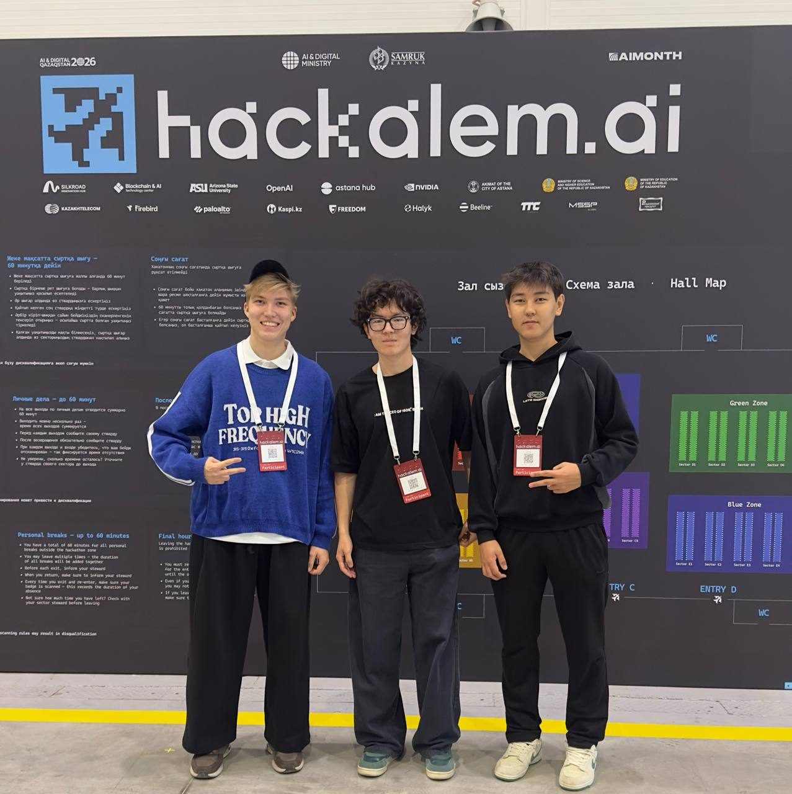
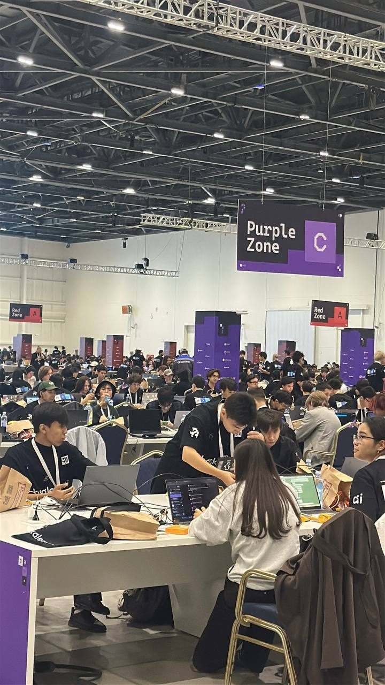
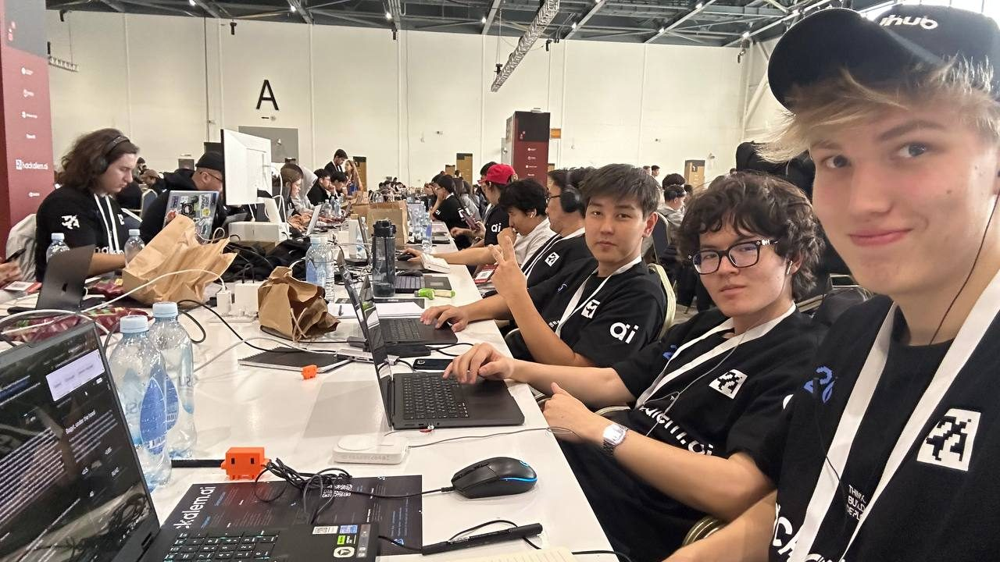
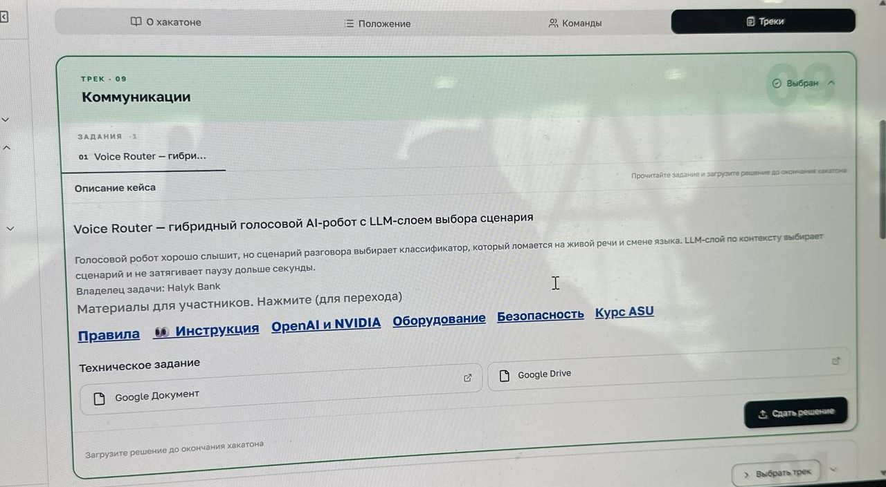
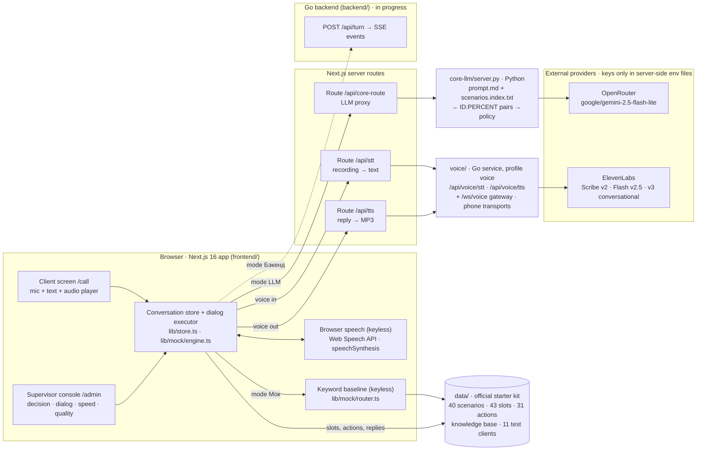
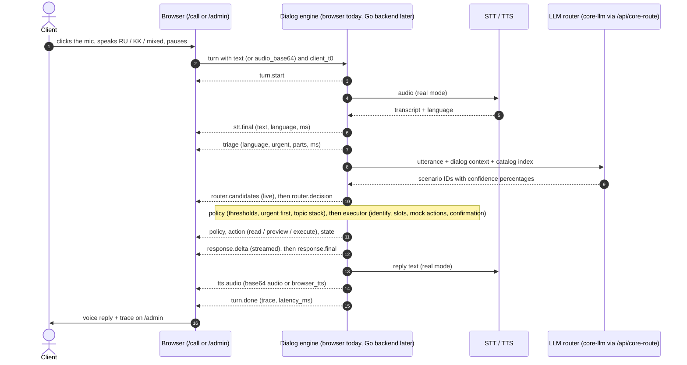
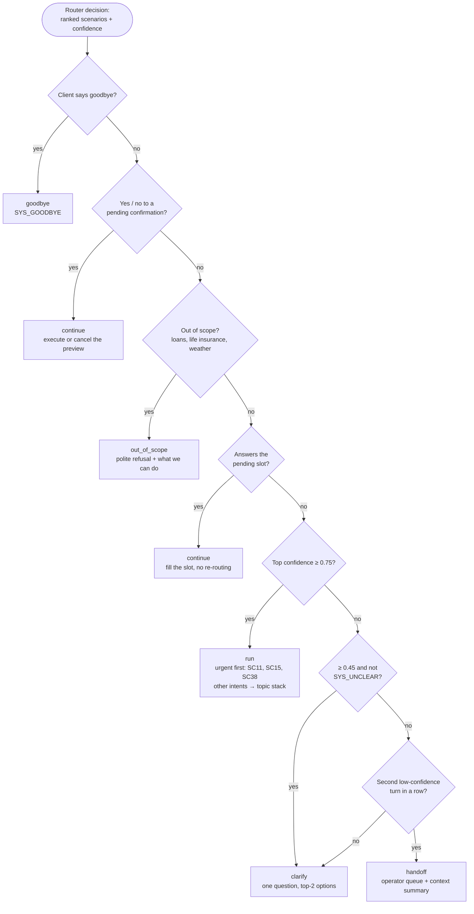
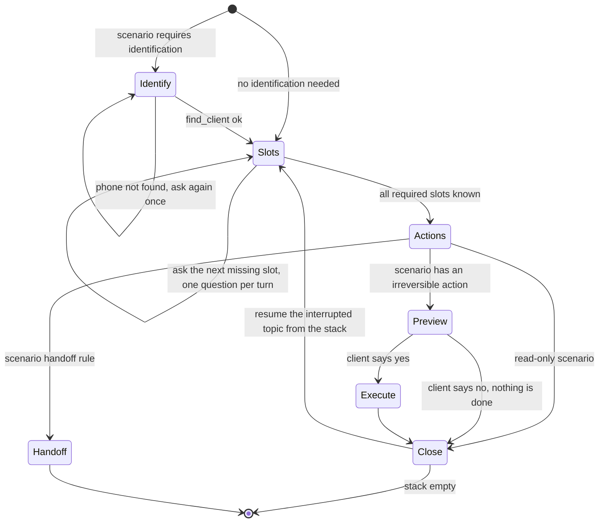

<div align="center">

# Bagyt · Voice Router

*Бағыт — "direction, route" in Kazakh*

**A web voice robot for an insurance contact center. The client speaks Russian, Kazakh, or both in one sentence. An LLM layer — not an intent classifier — picks one of 40 scenarios from the whole dialog, the robot answers by voice, and the supervisor sees which scenario was chosen, why, what the alternatives were, and how long every stage took.**

Team **Plus** · HackAlem AI 2026 · Track 09 «Communications» · Case **Halyk Bank — Voice Router**


<br/>
<sub>Team Plus at HackAlem AI · Astana · 23 September 2026 · <a href="#15-team">who built what</a> · <a href="#from-the-hackathon-floor">more photos</a></sub>


**[▶ Live demo: bagyt.plus](https://bagyt.plus)** · [Try it online](#try-it-online) — jury access, demo video · [OpenRouter](#51-openrouter--the-routing-llm) · [ElevenLabs](#52-elevenlabs--speech-in-and-out) · [Docs index](docs/README.md) · [LLM router](core-llm/README.md) · [Voice service](voice/README.md) · [API contract](docs/API_CONTRACT.md) · [Official case](docs/CASE.md)

</div>

> [!IMPORTANT]
> **Status on `main` (2026-09-23).**
> - **«LLM» mode — the product.** The web app sends every utterance with its dialog context through a same-origin Next.js proxy to the Python router [`core-llm/`](core-llm/) on **OpenRouter** (`google/gemini-2.5-flash-lite`; its author reports 104/104 on the dev set at ~457 ms p50). The client's voice is recognized by **ElevenLabs** Scribe v2 and every reply is spoken by ElevenLabs (Flash v2.5 in Russian, v3 conversational in Kazakh) through the Go voice service [`voice/`](voice/). Needs an OpenRouter key and an ElevenLabs key: `NEXT_PUBLIC_API_MODE=core docker compose --profile llm --profile voice up --build`.
> - **«Мок» mode — keyless.** The same UI, dialog executor, 31 mock backend actions, supervisor trace and quality metrics, with a transparent keyword baseline instead of the LLM and browser speech instead of ElevenLabs: `docker compose up --build` and nothing else.
> - **In progress 🚧:** the Go backend («Бэкенд» mode), streaming voice in the web app (the voice service's `/ws/voice` gateway), persistence and a public deployment. Every capability below is marked ✅ / 🚧 / 📋.
<!-- TODO(team): when the Go backend / streaming voice / deploy land, rewrite this callout and flip the statuses in §2, §4.6, §5, §8.5. -->

> **Кратко по-русски.** Bagyt — веб-симулятор голосового робота контакт-центра страховой компании (вымышленная Saqta Insurance из стартового кита Halyk Bank). Клиент говорит по-русски, по-казахски или вперемешку; робот выбирает один из 40 сценариев с учётом всего диалога, отвечает голосом, переспрашивает, когда не уверен, передаёт разговор оператору с контекстом и не выполняет необратимых действий без явного «да». Супервизор после каждой реплики видит сценарий, уверенность, обоснование, альтернативы и задержку по этапам. Проверка без ключей: `docker compose up --build` → http://localhost:3000/admin, режим «Мок» (прозрачный детерминированный baseline вместо LLM). С ключом OpenRouter в `core-llm/.env`: `NEXT_PUBLIC_API_MODE=core docker compose --profile llm up --build` — режим «LLM» и продуктовый роутер [`core-llm/`](core-llm/) (Gemini 2.5 Flash-Lite через OpenRouter, 104/104 на dev-наборе по отчёту автора, ~457 мс p50). Голос в режиме «LLM» — ElevenLabs: распознавание Scribe v2 (`language_code=kk` понимает русский, казахский и смешанную речь) и озвучка Flash v2.5 (RU) / v3 conversational (KZ); нужен `ELEVENLABS_API_KEY` в корневом `.env` и `NEXT_PUBLIC_API_MODE=core docker compose --profile llm --profile voice up --build`. Живая версия: https://bagyt.plus.

### From the hackathon floor

<details>
<summary>Photos from the day: the entrance, the hall, the team at work, picking the case</summary>

<table>
  <tr>
    <td width="33%" align="center"><br/><sub>The morning queue at the entrance</sub></td>
    <td width="33%" align="center"><br/><sub>The hall</sub></td>
    <td width="33%" align="center"><br/><sub>Swag</sub></td>
  </tr>
  <tr>
    <td colspan="2" align="center"><br/><sub>Building Bagyt</sub></td>
    <td align="center"><br/><sub>qairuhub</sub></td>
  </tr>
  <tr>
    <td colspan="3" align="center"><br/><sub>Picking the case: Track 09 «Коммуникации» → Voice Router</sub></td>
  </tr>
</table>

</details>

## Jury quick path

| The organizers ask | Short answer | Details |
|---|---|---|
| **What does it solve?** | Voice robots mis-route live speech — topic switches, requests between two scenarios, Russian↔Kazakh switching inside a phrase — because the scenario is picked by an encoder intent classifier. Bagyt picks it with an LLM layer over the dialog context, asks or hands off when unsure, and shows the supervisor why. | [§1](#1-problem-and-users) |
| **How do I run it?** | Live: **[bagyt.plus](https://bagyt.plus)**. Locally: `docker compose up --build` → open http://localhost:3000/admin — mode «Мок», no keys. With keys (OpenRouter in `core-llm/.env`, ElevenLabs in `.env`): `NEXT_PUBLIC_API_MODE=core docker compose --profile llm --profile voice up --build` → «LLM» mode with ElevenLabs voice. Without Docker: `cd frontend && npm ci && npm run dev`. | [§7](#7-install-and-run) |
| **Which technologies?** | Next.js 16 · React 19 · TypeScript · Tailwind 4 · Python LLM core on **OpenRouter** (Gemini 2.5 Flash-Lite) · Go 1.26 voice service on **ElevenLabs** (Scribe v2 STT, Flash v2.5 / v3 conversational TTS) · browser Web Speech API as the keyless fallback | [§5](#5-technologies) |
| **How do I verify it?** | A 10-step walkthrough in the web app (RU, KZ, mixed, multi-intent, topic return, confirmation, clarify → handoff), the same phrases in «LLM» mode, the official `evaluate.py` and the unit tests | [§8](#8-how-to-verify) |

## Try it online

<!-- TODO(team): fill the four ⏳ cells before 18:00. Demo accounts only — never put API keys here; they stay in the server's environment. -->

| | |
|---|---|
| 🌐 **Live app** | **[bagyt.plus](https://bagyt.plus)** |
| 🔑 **Jury access** | Login: ⏳ · Password: ⏳ — or *"no login required"* |
| 🎬 **Demo video** (3 min) | ⏳ link |
| 🧪 **Test clients** | Say or type a phone when the robot asks: `+77010000007` Sergey Popov (claim under review) · `+77010000001` Arman Tulegenov (OGPO + CASCO) · `+77010000003` Yerlan Omarov (policy to renew) — all synthetic, [§8.3](#83-test-clients) |

**About API keys.** None are in this repository, on purpose. The live app runs with our OpenRouter and ElevenLabs keys stored as environment variables on the host, so nothing is needed on your side. Locally, «Мок» works with no keys at all, and «LLM» with voice needs your own keys in the env files ([§7.6](#76-environment-variables)).

**Test it in 60 seconds:**

1. Open **[bagyt.plus](https://bagyt.plus)** → **«Консоль»** (the conversation on the left, the robot's reasoning on the right). Log in with the jury access above if asked.
2. The live app keeps the OpenRouter and ElevenLabs keys on the server — you need no keys of your own. Turn the replies' sound on with the speaker icon next to the text field.
3. Click the mic, say **«Хочу продлить ОГПО и добавить сына»** and click again to send — or type it. Then try **«Кеше аварияға түстім, но я не виноват, виновник у вас застрахован»**.
4. After each phrase, read the right column: the scenarios with confidence, why, the rejected alternatives, what the robot did and how many milliseconds each stage took.
5. More: the 10-step walkthrough in [§8](#8-how-to-verify) · no key? `docker compose up --build` gives the keyless «Мок» build ([§7.1](#71-quick-start--keyless-about-two-minutes)).

## Contents

1. [Problem and users](#1-problem-and-users)
2. [What is implemented](#2-what-is-implemented)
3. [How it works](#3-how-it-works)
4. [Architecture](#4-architecture)
5. [Technologies](#5-technologies)
6. [Requirements](#6-requirements)
7. [Install and run](#7-install-and-run)
8. [How to verify](#8-how-to-verify)
9. [Results](#9-results)
10. [Data and integrations](#10-data-and-integrations)
11. [Design](#11-design)
12. [Decision log](#12-decision-log)
13. [Limitations and known issues](#13-limitations-and-known-issues)
14. [Roadmap](#14-roadmap)
15. [Team](#15-team)
16. [Documentation map](#16-documentation-map)
17. [Maintaining this README](#17-maintaining-this-readme)

---

## 1. Problem and users

**The problem (from the [case](docs/CASE.md)).** Voice robots have learned to speak and listen well, but the layer that chooses the conversation scenario is usually still an encoder intent classifier trained on fixed phrasings. It breaks exactly where live speech starts: the client changes topic mid-dialog, asks something on the border of two scenarios, or switches from Russian to Kazakh inside one sentence. Every wrong choice is a transfer to an operator or a lost client — and a pause longer than a second already sounds like a dropped call.

**Who it is for.**

| User | What they need | What Bagyt gives them |
|---|---|---|
| Contact-center client | Explain the problem in their own words — in Russian, Kazakh or both; change topic; get it solved without an operator | Scenario chosen from the whole dialog, not from keywords; a topic stack that returns to interrupted questions; answers grounded in the client's own data; a voice reply in the client's language |
| Supervisor / operator | See which scenario was chosen, why, where the robot hesitated or failed, and how fast it was | A trace after every turn — scenario, confidence, reason, alternatives, policy verdict, actions, per-stage latency — plus the official quality metrics on the dev set |

**Domain.** The organizer's synthetic starter kit: **Saqta Insurance**, a fictional Kazakh non-life insurer (OGPO motor liability, CASCO, DMS health, travel, property, accident) — 40 scenarios + 3 system intents, 43 slots, 31 backend actions, a knowledge base and 11 test clients. "Today" in the data is **2026-10-01**.

**Our answer in one line.** Replace the classifier with an LLM routing layer that reads a compact index of every scenario — its meaning, Russian and Kazakh cues, and `not_this_if` boundaries — together with the dialog context, and answers with scenario IDs and confidence percentages only. A deterministic policy, not the model, then decides whether to act, ask, or hand the call to a human, and assembles the explanation the supervisor sees.

---

## 2. What is implemented

Legend: ✅ works on `main` · 🚧 in progress, not on `main` yet · 📋 planned · ❌ cut · ⏳ to be filled in

<!-- TODO(team): flip statuses as features land on main; keep "Where" pointing at real files. -->

### Client conversation

| Capability | Status | Where |
|---|---|---|
| **ElevenLabs speech recognition:** click the mic to record, click again to send → Next.js `POST /api/stt` → voice service `POST /api/voice/stt` → Scribe v2 with `language_code=kk` (Russian, Kazakh and mixed speech). The recognizer in «LLM» mode; in «Мок» the browser's Web Speech recognizes, and its network errors switch to ElevenLabs automatically | ✅ needs `ELEVENLABS_API_KEY` + `--profile voice` | [`api/stt/route.ts`](frontend/src/app/api/stt/route.ts), [`voice/`](voice/) — [§5.2](#52-elevenlabs--speech-in-and-out) |
| **ElevenLabs voice replies** in «LLM» mode: Next.js `POST /api/tts` → voice service → Flash v2.5 for Russian, v3 conversational for Kazakh, the Russian voice for English greetings. Each reply keeps its MP3 for the conversation: play/pause, seekable waveform, elapsed/duration, download | ✅ needs `ELEVENLABS_API_KEY` + `--profile voice` | [`api/tts/route.ts`](frontend/src/app/api/tts/route.ts), [`audio-message.tsx`](frontend/src/components/app/audio-message.tsx) |
| Browser voice (keyless): Web Speech API in, `speechSynthesis` out — «Мок» mode, and the fallback when the voice service is unavailable | ✅ | [`frontend/src/lib/voice.ts`](frontend/src/lib/voice.ts) |
| Text input as the fallback channel | ✅ | [`conversation-panel.tsx`](frontend/src/components/app/conversation-panel.tsx) |
| Interface language RU / ҚАЗ in the header, saved in the browser; it does not change speech recognition or the reply language | ✅ | [`lib/ui-language.ts`](frontend/src/lib/ui-language.ts) |
| Language detection `ru` / `kk` / `mixed`; answer in the client's dominant language, keep the session language on code-switched turns | ✅ | [`mock/router.ts`](frontend/src/lib/mock/router.ts), [`mock/engine.ts`](frontend/src/lib/mock/engine.ts) |
| Client identification by phone / IIN against `mock_backend.json`; spoken numbers → digits in RU and KZ («плюс жеті жеті жүз бір…» → `+7701…`) | ✅ | `mock/router.ts` (`wordsToDigits`, `extractSlots`) |

### Routing and dialog logic

| Capability | Status | Where |
|---|---|---|
| **LLM router** — the product: system prompt + a compact index of the catalog (`scenarios.index.txt`) + dialog context → `ID:PERCENT` pairs → decision policy. CLI, dev-set evaluation, dialog replay with context, model benchmark | ✅ | [`core-llm/router.py`](core-llm/router.py), [`core-llm/prompt.md`](core-llm/prompt.md), [`core-llm/scenarios.index.txt`](core-llm/scenarios.index.txt) |
| **«LLM» mode in the web app:** browser → same-origin proxy `POST /api/core-route` → `core-llm/server.py` (`POST /api/route`, port 8090, private) → OpenRouter. The core's verdict (`route` / `clarify` / `handoff` / `out_of_scope` / `goodbye`) is authoritative; the browser executor then collects slots and runs the demo actions. The key never reaches the browser, and there is no silent fallback to the mock | ✅ needs `OPENROUTER_API_KEY` | [`api/core-route/route.ts`](frontend/src/app/api/core-route/route.ts), [`lib/core-router.ts`](frontend/src/lib/core-router.ts), [`core-llm/server.py`](core-llm/server.py) |
| The same routing inside the Go turn API (SSE) | 🚧 | integration notes in [`core-llm/README.md`](core-llm/README.md) |
| Router output contract used by the UI: ranked `scenarios[]` with confidence + reason, `alternatives[]`, `language`, `slots`, `is_continuation`, `model`, `tier` | ✅ | [`frontend/src/lib/contract.ts`](frontend/src/lib/contract.ts) |
| Keyless mock router: token overlap with the catalog's ru/kk examples + hand-written cues that mirror `not_this_if`; labelled «Мок» in the UI | ✅ | `mock/router.ts` |
| Multi-intent: split the utterance; urgent scenarios first (SC11, SC15, SC38), then in spoken order | ✅ | `core-llm/prompt.md`, `mock/router.ts`, `mock/engine.ts` |
| Decision policy: ≥ 0.75 run · 0.45–0.75 clarify · < 0.45 twice → handoff · out-of-scope · goodbye (UI); route ≥ 60 % · extra intents ≥ 20 % (core-llm) | ✅ | `mock/engine.ts` (`decide`), `core-llm/router.py` (`Router.decide`) |
| Topic stack: park the interrupted scenario, come back to it when the new one is done | ✅ | `mock/engine.ts` |
| Continuation: an answer to a pending slot or a yes/no question is not re-routed | ✅ | `mock/engine.ts`, `core-llm/prompt.md` (CONTEXT rules) |
| Greetings without a request — `SYS_GREETING` (`status: greeting`, policy action `greeting`), an application system intent; the official 40 scenarios are unchanged. Replies «Здравствуйте, чем могу помочь?» / «Сәлеметсіз бе, қалай көмектесе аламын?» / “Hello, how can I help you?” (for “Hello”, “Hi”, “Good morning”) through the same TTS path; keeps the active scenario, the pending slot or confirmation and the queue, and does not count as an unclear turn. «Здравствуйте, хочу продлить полис» still routes to SC27 | ✅ | `core-llm/prompt.md`, `core-llm/router.py`, `mock/engine.ts` |
| Slot extraction: phone, IIN, policy / claim number, plate, city, dates relative to 2026-10-01, doctor, country, … | ✅ | `mock/router.ts` |
| Scenario executor: identify → one question per missing slot → actions → read back → explicit «да» → execute → close | ✅ | `mock/engine.ts` (`execute`, `confirmFlow`) |
| All 31 backend actions of `actions.json` as mocks over `mock_backend.json` + `knowledge_base.json` | ✅ | [`mock/actions.ts`](frontend/src/lib/mock/actions.ts) |
| The 9 irreversible actions run only after a preview and an explicit confirmation | ✅ | `mock/actions.ts`, `mock/engine.ts` |
| Handoff to one of 6 operator queues with a context summary | ✅ | `mock/engine.ts` |
| Hybrid fast path with a measured latency gain | 📋 | — |
| Speculative routing on partial transcripts | 📋 | — |

### Supervisor console (`/admin`)

| Capability | Status | Where |
|---|---|---|
| Conversation next to «what the robot understood»: scenario, confidence, reason, live candidates, the catalog's boundary rules | ✅ | [`admin/page.tsx`](frontend/src/app/(console)/admin/page.tsx), `components/app/admin/decision.tsx` |
| Dialog state: client, awaited slot or confirmation, known data, actions (read / preview / executed) | ✅ | `components/app/admin/dialog.tsx` |
| Per-stage latency waterfall against the 1.5 s target | ✅ (mock timings are simulated) | `components/app/admin/speed.tsx` |
| Session metrics: turns, average confidence, clarifications, handoffs, median response time | ✅ (in memory) | [`lib/api.ts`](frontend/src/lib/api.ts) (`computeStats`) |
| Routing quality card (the official `evaluate.py` metrics on the dev set in one click) | ❌ removed from the console in `bc402c6` — run the metrics from the CLI ([§8.4](#84-reproduce-the-numbers-from-a-terminal)) | `components/app/admin/quality.tsx` (unused) |
| Trace JSON of the last turn in the dataset README format | ✅ | `components/app/admin/shared.tsx` (`readmeTrace`) |
| Turn log | ✅ | `components/app/admin/turn-log.tsx` |
| History across sessions and error statistics over time (PostgreSQL) | 📋 | — |
| Catalog editing without developers | 📋 | — |

### Backend and infrastructure

| Capability | Status | Where |
|---|---|---|
| Go HTTP service with `GET /health` | ✅ | [`backend/cmd/server/main.go`](backend/cmd/server/main.go) |
| Go turn API behind «Бэкенд» mode: `POST /api/session`, `POST /api/turn` (SSE), trace, supervisor stats, scenarios, `POST /api/eval/run` | 🚧 contract fixed | [`docs/API_CONTRACT.md`](docs/API_CONTRACT.md) |
| LLM access: OpenRouter in `core-llm` ✅; OpenAI / NVIDIA / any OpenAI-compatible provider behind one Go interface 🚧 | ✅ · 🚧 | `core-llm/router.py` |
| **Voice service** `voice/` (Go): ElevenLabs Scribe v2 (streaming and batch) + per-language TTS; HTTP `/api/voice/stt` and `/api/voice/tts` used by the web app; a real-time WebSocket gateway `/ws/voice` with barge-in, speculative replies and cached fillers; per-call logs and p50/p95 latency stats | ✅ HTTP in the web app · 🚧 `/ws/voice` not wired to the web app yet | [`voice/`](voice/), [`voice/README.md`](voice/README.md) — [§5.2](#52-elevenlabs--speech-in-and-out) |
| geko.sh Seta STT / Tokay TTS (KZ-first) | 📋 | — |
| PostgreSQL persistence of turns and traces | 📋 | — |
| One command: `docker compose up --build` (web app, keyless); `--profile llm` adds the `core-llm` service, `--profile voice` the ElevenLabs voice service | ✅ | [`docker-compose.yml`](docker-compose.yml), [`frontend/Dockerfile`](frontend/Dockerfile), [`core-llm/Dockerfile`](core-llm/Dockerfile), [`voice/Dockerfile`](voice/Dockerfile) |
| Tests: the `core-llm` HTTP adapter and greetings; the frontend's core adapter and dialog engine; the voice service against fake ElevenLabs servers (no credits) | ✅ | [`core-llm/test_server.py`](core-llm/test_server.py), [`frontend/scripts/test-core.cjs`](frontend/scripts/test-core.cjs) (`npm test`), `voice/` (`go test ./...`) |
| Deployment (Railway) | ⏳ | ⏳ |
| Phone channel: Asterisk AudioSocket (a Kazakh SIP number) and Twilio Media Streams transports in the voice service, with a setup guide | ✅ code · ⏳ live number | [`voice/transport/`](voice/transport/), [`voice/deploy/README.md`](voice/deploy/README.md) |
| Emotion detection and tone adaptation | ❌ cut | — |

---

## 3. How it works

### 3.1 One turn, from voice to answer

1. **Hear.** The client clicks the mic and speaks. In «LLM» mode the recording goes through `/api/stt` and the voice service to **ElevenLabs Scribe v2** with `language_code=kk`, which handles Russian, Kazakh and mixed speech — a second click sends it. In «Мок» the browser's Web Speech API transcribes (`ru-RU` or `kk-KZ`) and stops on a pause. The moment the client stops speaking is `client_t0` — latency is measured from it.
2. **Triage.** Language `ru` / `kk` / `mixed`, normalization (spoken numbers → digits), urgency, and the split of a multi-intent utterance into parts.
3. **Route.** In «LLM» mode the utterance and its dialog context — previous turns with their scenarios, the active scenario, the bot's last reply — go through the same-origin proxy `/api/core-route` to `core-llm`. The model answers with nothing but `ID:PERCENT` pairs (about 6 tokens, which keeps routing near 450 ms); the core applies its policy, and the explanation shown to the supervisor is assembled deterministically from the scenario names, the percentages and the verdict. In «Мок» mode the keyword baseline returns the same shape. The console shows the candidates and their confidence.
4. **Decide.** Deterministic policy code — not the model — turns the ranking into an action: `run`, `continue`, `clarify`, `handoff`, `out_of_scope` or `goodbye`. Urgent scenarios go first; the rest wait on the topic stack.
5. **Act.** A per-scenario state machine driven by `scenarios.json`: identify the client, ask for the next missing slot, call mock actions, read back and wait for an explicit «да» before anything irreversible, close, then resume the interrupted topic.
6. **Answer.** One or two sentences built from the scenario's response templates and real action results — never invented facts — streamed sentence by sentence.
7. **Speak.** TTS in the reply language: in «LLM» mode **ElevenLabs** Flash v2.5 for Russian and v3 conversational for Kazakh — the only realtime ElevenLabs model that speaks it — with a replayable, downloadable recording; browser speech in «Мок». End-to-end latency = end of the client's speech → first audio of the answer.
8. **Explain.** The turn ends with a trace in the dataset README format; `/admin` renders it next to the conversation.

### 3.2 The LLM router in one call

```text
$ python3 core-llm/router.py "Хочу продлить ОГПО и заодно добавить в него сына"
SC27:95 SC04:95   (primary SC27, intents [SC27, SC04], status route, ~450 ms)
```

One line out of the model: two requested scenarios (renewal SC27, add a driver SC04), both at 95 %, in spoken order. The policy turns it into `status=route` with two intents; an unsure answer (< 60 %) becomes `clarify`, and `SYS_OUT_OF_SCOPE` / `SYS_GOODBYE` / SC37 become `out_of_scope` / `goodbye` / `handoff`. Example from [`core-llm/README.md`](core-llm/README.md).

### 3.3 A real trace from the web app

The case's own example, typed into the web app in mock mode on `main` (produced by the same engine the browser runs):

```json
{
  "turn": 1,
  "transcript": "Здравствуйте, я вчера оплатил, деньги списались, а заказ не подтвердился… а, и ещё, адрес доставки поменять надо",
  "language": "ru",
  "scenarios": [
    { "scenario_id": "SC30", "confidence": 0.94, "reason": "Charged but policy not issued — в реплике есть признак «деньги списал»" },
    { "scenario_id": "SC29", "confidence": 0.82, "reason": "Update contact details — похоже на примеры этого сценария из каталога" }
  ],
  "alternatives": [
    { "scenario_id": "SC33", "confidence": 0.34 },
    { "scenario_id": "SC31", "confidence": 0.17 },
    { "scenario_id": "SC12", "confidence": 0.15 }
  ],
  "reason": "Charged but policy not issued — в реплике есть признак «деньги списал»",
  "slots": { "incident_date": "2026-09-30", "contact_field": "address" },
  "actions": [],
  "latency_ms": { "stt": 43, "triage": 30, "router": 327, "policy": 16, "executor": 0, "response": 140, "tts_first_audio": 0, "total": 556 }
}
```

How to read it:

- **Two requests in one breath → two scenarios, in spoken order:** SC30 "Charged but policy not issued" (0.94) and SC29 "Update contact details" (0.82). The policy verdict is `run` SC30 with SC29 parked on the stack (`"stack": ["SC29"]`).
- **Alternatives** show what was considered and rejected: SC33 office addresses (0.34), SC31 payment methods (0.17), SC12 victim claim (0.15).
- **Slots** are already extracted: «вчера» → `incident_date: 2026-09-30` (relative to the dataset's "today", 2026-10-01); «адрес … поменять» → `contact_field: address`.
- **The answer** acknowledges the second request and asks for the phone number, because SC30 requires identification: «Поняла, второй вопрос (обновление контактных данных) тоже разберём. Разберёмся. Подскажите, пожалуйста, ваш номер телефона.»
- **`latency_ms`:** in mock mode the stage timings are simulated delays; in the browser `tts_first_audio` and `total` are replaced by real measurements (end of speech → first audio).

---

## 4. Architecture

### 4.1 System overview



One conversation store and one dialog executor drive both screens. The build-time mode `NEXT_PUBLIC_API_MODE` (`mock` / `core` / `real`) picks the router: the keyword baseline in the browser, the Python LLM core behind a same-origin proxy, or the Go backend (in progress). Every mode produces the **same typed event stream**, so the UI does not know the difference. Voice goes through two more same-origin routes, `/api/stt` and `/api/tts`, to the Go voice service, which alone holds the ElevenLabs key; in Compose it runs with `VOICE_BRAIN=echo`, so routing stays in `core-llm`. API keys stay on the server side (`core-llm/.env`, the root `.env`) and never reach the browser. The Go backend will reuse the core's two text files and its policy, as described in [`core-llm/README.md`](core-llm/README.md).

### 4.2 One turn as an event stream



| Event | Payload | What it drives in the UI |
|---|---|---|
| `turn.start` | `turn`, `session_id`, `t0` | a new row in the turn log |
| `stt.partial` / `stt.final` | `text`, `language`, `ms` | live transcript, language badge |
| `triage` | `language`, `urgent`, `parts[]`, `normalized`, `ms` | parts of a multi-intent utterance |
| `router.candidates` (0..n) | `candidates[]`, `partial` | live confidence bars |
| `router.decision` | `RouterDecision`, `ms` | scenario, reason, alternatives |
| `policy` | `PolicyVerdict`, `ms` | run / continue / clarify / handoff / out_of_scope / goodbye |
| `action` (0..n) | `ActionCall` — mode `read` / `preview` / `execute` | the actions list |
| `state` | `DialogState` | dialog card: client, awaited slot, stack |
| `response.delta` / `response.final` | `text`, `language`, `ms` | the streamed reply bubble |
| `tts.audio` | `audio_base64` + `mime`, or `browser_tts: true` | playback |
| `turn.done` | `Trace`, `latency_ms` | trace JSON, speed waterfall, metrics |
| `error` | `message` | error banner; ends the turn |

In «Мок» and «LLM» modes these events are produced in the browser; the Go backend will stream the same events over `POST /api/turn` → `text/event-stream`, one JSON event per `data:` line. Contract: [`docs/API_CONTRACT.md`](docs/API_CONTRACT.md); types: [`frontend/src/lib/contract.ts`](frontend/src/lib/contract.ts).

### 4.3 Decision policy



In «LLM» mode the core's verdict is authoritative (`route_status`: route / clarify / handoff / out_of_scope / goodbye; a scenario counts as requested from `ROUTER_THRESHOLD=60` %, extra intents from 20 %). The thresholds in the diagram (`CONFIDENCE_RUN = 0.75`, `CONFIDENCE_CLARIFY = 0.45` in [`contract.ts`](frontend/src/lib/contract.ts), from the dataset README) apply to the keyword baseline. An explicit request for a human (SC37) goes straight to handoff. **The model proposes, code disposes:** the router never executes anything by itself.

### 4.4 Scenario executor



Slots already known from the identified client (phone, IIN, e-mail, city, the matching policy or claim) are filled automatically, so the robot does not ask for what it already knows.

### 4.5 Dialog state

Kept per session and sent to the UI after every turn (`state` event):

```json
{
  "session_id": "s_ab12", "language": "ru",
  "client_id": "C007", "client_name": "Sergey Popov",
  "active_scenario": "SC17", "stack": ["SC27"],
  "slots": { "phone": "+77010000007" },
  "awaiting": { "kind": "slot", "slot": "claim_number" },
  "low_conf_streak": 0, "turn": 3, "ended": false
}
```

`awaiting` is `null`, `{ "kind": "slot", "slot": … }` or `{ "kind": "confirmation", "action": … }`.

### 4.6 Three modes, one contract

| | «Мок» (default) | «LLM» — the product | «Бэкенд» |
|---|---|---|---|
| Chosen at build time | `NEXT_PUBLIC_API_MODE=mock` (default) | `NEXT_PUBLIC_API_MODE=core` | `NEXT_PUBLIC_API_MODE=real` |
| Router | keyword / cue baseline in the browser (`mock-lexical`) | `core-llm` via `/api/core-route` → OpenRouter (`google/gemini-2.5-flash-lite`) | Go backend, `POST /api/turn` (SSE) |
| Policy, slots, actions, replies | browser dialog executor over the starter kit ([`frontend/src/lib/mock/`](frontend/src/lib/mock/)) | the core's verdict + the same browser executor | Go backend |
| STT | Web Speech API (Chrome / Edge) | ElevenLabs Scribe v2 via `/api/stt` (default) or Web Speech | ElevenLabs Scribe v2 Realtime, streamed |
| TTS | browser `speechSynthesis` | ElevenLabs via `/api/tts`: Flash v2.5 (RU) · v3 conversational (KZ); browser speech as the fallback | ElevenLabs over WebSockets |
| Keys | none | `OPENROUTER_API_KEY` in `core-llm/.env`; `ELEVENLABS_API_KEY` in `.env` for voice | provider keys in `.env` |
| Run | `docker compose up --build` | `NEXT_PUBLIC_API_MODE=core docker compose --profile llm --profile voice up --build` | — |
| Status | ✅ | ✅ | 🚧 |

### 4.7 Why this is not an intent classifier — and not hardcoded

- **No encoder, no training.** Nothing in this repo is a model trained to map utterances to intents. The product router is a generative LLM that reads a compact index of each scenario — its meaning, Russian and Kazakh cues, and `not_this_if` boundaries (e.g. "approved, but too little" → SC19 dispute, not SC17 status) — together with the dialog context, and answers with scenario IDs and confidence percentages ([`core-llm/`](core-llm/)).
- **The model proposes, code decides.** Thresholds, clarification, handoff and confirmation are deterministic policy, so a wrong or unsure model turns into a question or a human — not into a wrong action. The supervisor's explanation is assembled from the catalog, the percentages and the thresholds, so it always matches what the policy actually did.
- **The catalog is data.** Scenarios, slots, actions and reply templates are read from the starter-kit JSON; the LLM reads a hand-made index of the same catalog. A new scenario means a JSON entry and an index line — no code change and no retraining.
- **The jury's utterances are not in the repo.** `dev_utterances.json` is read only by the evaluators ([`lib/eval.ts`](frontend/src/lib/eval.ts), [`scripts/eval-mock.ts`](frontend/scripts/eval-mock.ts), `core-llm/router.py --eval`), never by a router at runtime.
- **Honest about tuning.** Both the mock's cue lists and the LLM prompt were refined against the dev set, so both dev-set scores are reported as in-sample ([§9.1](#91-routing-accuracy-on-the-dev-set)). The mock is labelled «Мок» everywhere and is not our answer to the case.

### 4.8 Repository map

```text
.
├── frontend/                    Next.js 16 app — the product UI; runs end-to-end in mock mode
│   ├── src/app/                 routes: / (landing) · /call (client) · /admin (supervisor) · api/core-route (LLM) · api/stt + api/tts (voice)
│   ├── src/lib/contract.ts      frontend ⇄ backend event and trace contract (source of truth)
│   ├── src/lib/core-router.ts   adapter: the core-llm result → the UI's RouterDecision
│   ├── src/lib/store.ts         conversation store shared by /call and /admin
│   ├── src/lib/api.ts           mock ⇄ real switch, SSE reader, session stats
│   ├── src/lib/voice.ts         browser STT / TTS / audio recorder
│   ├── src/lib/eval.ts          port of data/evaluate.py for the /admin quality card
│   ├── src/lib/mock/            router.ts · engine.ts (policy + executor) · actions.ts (31 mock actions)
│   ├── src/components/          app/ (console) · landing/ · ui/ (coss ui) · block/ (ObsidianUI)
│   ├── src/data/                copies of ../data/*.json used by the browser
│   └── scripts/                 eval-mock.ts (dev set) · replay-dialogs.ts (sample dialogs) · test-core.cjs (npm test)
├── core-llm/                    LLM router core (Python, standard library only)
│   ├── prompt.md                system prompt: output format, multi-intent, system intents, context rules
│   ├── scenarios.index.txt      compact catalog index: meaning · ru cues · kk cues · ≠ boundaries
│   ├── router.py                Router class · CLI · --eval · --dialogs · --bench
│   ├── server.py                private HTTP adapter: GET /healthz, POST /api/route (port 8090)
│   └── test_server.py           unit tests for the adapter
├── voice/                       ElevenLabs voice service (Go): STT / TTS, /ws/voice gateway, phone, logs
│   ├── elevenlabs/              client: Scribe v2 Realtime + batch STT, TTS over HTTP and WebSockets
│   ├── speech/                  per-language model routing, on-disk phrase cache, LLM-delta chunker
│   ├── agent/ · brain/          real-time conversation engine · reply brains (backend / OpenRouter / echo)
│   ├── transport/ · deploy/     browser WebSocket, Asterisk AudioSocket, Twilio · phone setup
│   └── server/ · cmd/           HTTP routes (/api/voice/stt, /api/voice/tts, /api/voice/stats …) · binaries
├── backend/                     Go service (net/http): GET /healthz + /health, Dockerfile; turn API in progress
├── docker-compose.yml           web app, Go backend, PostgreSQL; profiles "llm" (core-llm), "voice" (ElevenLabs), "server" (both)
├── data/                        official starter kit (read-only) + our predictions_mock.json
├── docs/                        case, analysis, PRD, SPEC, API contract, tasks, pitch, progress, research, design
├── DESIGN.md                    design-system reference
├── THIRD_PARTY.md               every third-party component, model, dataset and API we use
├── .env.example                 backend variables, keyless defaults
└── AGENTS.md · CLAUDE.md        rules for AI coding agents working in this repo
```

---

## 5. Technologies

| Layer | Technology | Version | Used for | Status |
|---|---|---|---|---|
| Frontend | Next.js (App Router), React, TypeScript | 16.3.6 · 19.2.8 · 5 | Landing, client screen, supervisor console; server routes `/api/core-route`, `/api/stt`, `/api/tts` | ✅ |
| UI | Tailwind CSS · coss ui on Base UI (`@base-ui/react`) · ObsidianUI blocks · lucide-react · GSAP | 4 · 1.8 · — · — · 3.15 | Design system, accessible primitives, icons, landing text stream | ✅ |
| Typography | Geist, Geist Mono via `next/font` (latin + cyrillic) | — | Text; mono only for numbers and IDs | ✅ |
| LLM router | Python 3 (standard library only) · **OpenRouter** · `google/gemini-2.5-flash-lite` by default (any model via `ROUTER_MODEL`) | — | Scenario choice: `ID:PERCENT` pairs, `temperature=0`, reasoning off, provider sorted by latency; a private HTTP adapter for the web app — [§5.1](#51-openrouter--the-routing-llm) | ✅ |
| LLM, Go backend | One OpenAI-compatible client: OpenAI (`gpt-4.1-mini`), NVIDIA Build (`meta/llama-3.3-70b-instruct`), OpenRouter / Groq / Gemini / Ollama via `LLM_BASE_URL`; `mock` | — | The same routing inside the turn API | 🚧 |
| Browser speech | Web Speech API (`SpeechRecognition`), `speechSynthesis`, `MediaRecorder` | built in | Keyless STT / TTS; audio capture | ✅ |
| Speech | **ElevenLabs** Scribe v2 (`scribe_v2_realtime`, `language_code=kk` — also transcribes Russian and mixed speech) · `eleven_flash_v2_5` (RU TTS) · `eleven_v3_conversational` (KZ TTS) | — | Recognition and voice replies — [§5.2](#52-elevenlabs--speech-in-and-out) | ✅ web app («LLM») · streaming gateway in `voice/` |
| Voice service | Go · `github.com/coder/websocket` | 1.26 | ElevenLabs STT / TTS behind `/api/voice/*`, the `/ws/voice` gateway, phone transports, latency logs | ✅ |
| Speech, alternative | geko.sh Seta `seta-kk-ru-v2` (STT) · Tokay `tokay-kk-v1` (TTS) | — | KZ-first recognition with code-switching | 📋 |
| Backend | Go, standard `net/http` | 1.26.5 | API gateway and the turn pipeline | ✅ health · 🚧 API |
| Storage | PostgreSQL | — | Turns, traces, statistics | 📋 |
| Evaluation | Python 3 — official [`data/evaluate.py`](data/evaluate.py); TypeScript scripts run with `tsx` | — | Dev-set accuracy, sample-dialog replay | ✅ |
| Tests | `node:test` + the TypeScript compiler (`npm test`) · Python `unittest` · `go test` with fake ElevenLabs servers | — | Core adapter, dialog engine, the core's HTTP adapter, the voice service | ✅ |
| Infrastructure | Docker Compose (images `node:22-bookworm-slim`, `python:3.13-slim`, Go for `voice/`) · Railway | — | One-command run · hosting | ✅ · ⏳ |

Every third-party component, model, dataset and API with its license: [THIRD_PARTY.md](THIRD_PARTY.md).

### 5.1 OpenRouter — the routing LLM

OpenRouter is the one gateway to the LLM, used in two places: the scenario router [`core-llm/`](core-llm/) (behind «LLM» mode and the CLI) and the voice service's own brain ([`voice/brain/openrouter.go`](voice/brain/openrouter.go)). One key, any model, provider routing and a cost report for every call.

| Feature | How Bagyt uses it | Where |
|---|---|---|
| Any model behind one API | `google/gemini-2.5-flash-lite` by default; any OpenRouter model id through `ROUTER_MODEL` (router) or `OPENROUTER_MODEL` (voice service). 15+ models were compared on the same dev set with `router.py --bench` ([§9.1](#91-routing-accuracy-on-the-dev-set)) | `core-llm/router.py` |
| Provider routing | `provider: {sort: "latency", allow_fallbacks: true}` — the fastest healthy provider serves each call; `ROUTER_PROVIDER_SORT=latency \| throughput \| price` | `core-llm/router.py` |
| Model fallbacks | The voice brain sends `models: [primary, …fallbacks]` (`OPENROUTER_FALLBACK_MODELS=openai/gpt-4o-mini,openai/gpt-4.1-nano`), so a failing model does not drop the call | `voice/brain/openrouter.go` |
| Prompt caching | The system prompt (`prompt.md` + `scenarios.index.txt`, ~5,800 tokens) is byte-identical on every call, so ~75 % of it is served from the provider's cache; `warmup()` primes the connection and the cache at start | `core-llm/router.py` |
| Deterministic, tiny answers | `temperature=0`, `max_tokens=64`, reasoning off (`reasoning: {enabled: false}`, or `ROUTER_REASONING=minimal \| low`); the model answers with `ID:PERCENT` pairs, about 6 tokens, so decoding takes tens of milliseconds | `core-llm/router.py`, `core-llm/prompt.md` |
| Cost and usage per call | `usage: {include: true}` returns prompt, completion and cached tokens and the cost in USD; `--eval` and `--bench` print them — about $0.05 for the whole 104-utterance dev set | `core-llm/router.py` |
| Robust transport | One keep-alive HTTPS connection per thread (no TLS handshake per call), one retry on a dropped socket, an `X-Title` header; if a provider rejects `temperature` or `reasoning` (HTTP 400), the router drops that parameter and retries | `core-llm/router.py` |
| Streaming replies | The voice brain streams over server-sent events: the model first writes a `[[SC12\|0.88]]` header (scenario and confidence), then the spoken reply, which goes straight into TTS (`temperature` 0.3 for natural speech) | `voice/brain/openrouter.go` |
| Keys stay on the server | `OPENROUTER_API_KEY` lives in `core-llm/.env` (or the voice service's environment); the browser only talks to the same-origin `/api/core-route` | `frontend/src/app/api/core-route/route.ts` |

Measured: scenario choice **457 ms p50 · 617 ms p95** end to end (reported by the router's author, [§9.3](#93-latency)); first token **369 ms** for `gemini-2.5-flash-lite` against 705 ms for `gpt-4o-mini`, 794 ms for `claude-haiku-4.5` and 1,238 ms for `gpt-4.1-mini` ([§9.7](#97-voice-research-speech-to-text-text-to-speech-end-to-end)).

### 5.2 ElevenLabs — speech in and out

ElevenLabs handles both ends of the conversation. The Go voice service [`voice/`](voice/) (Compose profile `voice`) holds the key and the models; the web app reaches it through two same-origin routes, `/api/stt` and `/api/tts`, so the key never reaches the browser.

**In the web app** («LLM» mode, `--profile voice`):

| Feature | Details |
|---|---|
| Speech recognition | Click the mic to record, click again to send. The recording (webm / opus, up to 20 MiB) goes `POST /api/stt` → `POST /api/voice/stt` → Scribe v2 with `language_code=kk`; the answer is `{text, language, ms, provider: "elevenlabs"}` and the transcript appears in the conversation. ElevenLabs is the recognizer in «LLM» mode; in «Мок» the browser's Web Speech is, and its network errors switch to ElevenLabs by themselves |
| Voice replies | With sound on (the speaker icon), every reply is spoken by ElevenLabs: `POST /api/tts` → `POST /api/voice/tts` → `mp3_22050_32`. Russian → `eleven_flash_v2_5`, Kazakh → `eleven_v3_conversational`, English greetings → the Russian voice with English pronunciation (`lang: en`). Voice: Sarah (`EXAVITQu4vr4xnSDxMaL`), configurable per language |
| Audio player | Each reply keeps its MP3 for the conversation — play / pause, a seekable waveform computed from the recording, elapsed / duration and download — with the transcript below the player. Muting turns autoplay off but still creates the recording |
| Fallbacks | A service error shows a notice and falls back to browser speech; «Мок» always uses browser speech, so it needs no key (and has no downloadable recording) |

**In the voice service** ([`voice/README.md`](voice/README.md)):

| Feature | Details |
|---|---|
| Streaming recognition | Scribe v2 Realtime over WebSocket: 20 ms audio frames while the caller talks, partial captions every ~100–200 ms, word timestamps. `SpeechEnd()` maps the last word back to wall-clock time, so latency is measured from the real end of speech. Batch Scribe v2 handles whole recordings — what `/api/stt` uses today |
| Languages | `language_code=kk` for Russian, Kazakh and mixed speech: auto-detect heard Kazakh as Turkish, and `ru` as a secondary language bent mixed phrases towards Russian spelling. Domain keyterms bias recognition: `Saqta, ОГПО, КАСКО, ДМС, полис, сақтандыру` |
| End of turn | Push-to-talk commit on the web — the final transcript 263–325 ms after release; server VAD with a 0.4 s silence window on the phone (`VOICE_VAD_SILENCE_SECS`) |
| Voice per language | Flash v2.5 (~75 ms model latency) over the stream-input WebSocket for Russian; v3 conversational over the text-to-dialogue WebSocket for Kazakh — the only realtime ElevenLabs model that speaks it, and as fast (first audio 208–221 ms) |
| Output formats | `pcm_16000` (web), `pcm_8000` (Asterisk / a Kazakh SIP number), `ulaw_8000` (Twilio), `mp3_22050_32` (the web player) — no resampling on our side |
| Latency tricks | The TTS socket opens on the first partial; a chunker sends the first clause with `flush`, so audio starts early; a keep-alive HTTP/2 transport with `Warm()`; fixed phrases (greeting, the «Секунду.» filler played at 1.5 s) cached on disk — no latency and no credits after the first run; speculative replies; barge-in (`tts.clear`) |
| Channels | Browser WebSocket `/ws/voice` (push-to-talk or VAD), Asterisk AudioSocket, Twilio Media Streams, and a voice test page at `/` |
| Brains | `backend` (the team's `POST /api/turn`), `openrouter` (a built-in Saqta agent: catalog, knowledge base and mock clients in the prompt), `echo` (keyless — what Compose runs, because the web app routes with `core-llm`) |
| Observability | A JSONL log per call with `t_ms` for every stage, optional WAV recording, `/api/voice/events` (live SSE), `/api/voice/stats` (p50 / p95 of end of speech → first audio, STT, LLM first text, TTS first audio), `/api/voice/sessions` |
| Tooling | `go test ./...` against fake ElevenLabs servers (no credits); `go run ./cmd/voicedemo quota` (characters left on the plan), `voicedemo tts` / `stt` demos that write their latencies to [`voice/demos/RESULTS.md`](voice/demos/RESULTS.md); live smoke tests with `VOICE_LIVE=1` |

Measured with real providers ([§9.7](#97-voice-research-speech-to-text-text-to-speech-end-to-end)): final transcript **263–325 ms** after push-to-talk release; first audio **208–221 ms** in Kazakh and **211–245 ms** in Russian; **1.70–1.95 s** from the end of speech to the reply's first audio live in phone-like VAD mode, **~1.1 s** estimated for web push-to-talk. Smoke check through `/api/stt` on bundled synthetic recordings: RU payment → SC30 ✅, KK renewal → SC27 ✅, mixed → SC11 instead of SC12 ❌ because «кеше» (yesterday) was misrecognized ([§9.4](#94-speech-recognition-spot-checks-)). The team key is on the ElevenLabs Creator plan (~128k characters a month).

---

## 6. Requirements

| For | You need |
|---|---|
| Recommended — everything | **Docker with Compose v2.** Nothing else for «Мок»; an **OpenRouter API key** for «LLM»; an **ElevenLabs API key** for ElevenLabs voice |
| Without Docker | **Node.js 22+** with npm (the version in the Dockerfile; Next.js 16 itself needs ≥ 20.9), **Python 3.10+** for `core-llm` (standard library only) and **Go 1.26+** for the voice service |
| Voice | A microphone; browsers allow it on `localhost` or HTTPS only. ElevenLabs recognition works in any modern browser; the keyless Web Speech recognizer needs **Chrome or Edge** on desktop. Text works everywhere |
| Evaluation scripts | Python 3 for `data/evaluate.py`; `npx tsx` (npx downloads `tsx` on first run) |
| Go backend | Go ≥ 1.26.5 (see [`backend/go.mod`](backend/go.mod)) |
| API keys | **None for «Мок».** «LLM» needs OpenRouter, plus ElevenLabs for voice; «Бэкенд» will need provider keys ([§7.6](#76-environment-variables)) |

---

## 7. Install and run

Current platform header contains only Call/Console navigation and the RU/ҚАЗ interface language switch.
Interface language is saved locally and does not change speech recognition or reply language.
Runtime mode/STT selectors and the evaluation card are no longer shown in the platform.
Choose `NEXT_PUBLIC_API_MODE=mock|core` before building (for example,
`NEXT_PUBLIC_API_MODE=core docker compose --profile server up --build -d`).
Older screenshots/instructions mentioning header mode controls or the quality card describe the earlier UI;
CLI evaluation commands remain available.


### Server stack in Docker

Requires Docker Compose **v2.24+**. All server components now have images:
`backend` (Go API skeleton), `db` (PostgreSQL 17), `core-llm` (Python router), and `voice` (ElevenLabs STT/TTS).
The Go service currently exposes `/healthz` and the compatibility alias `/health`; its turn API and database persistence are not implemented yet. The working dialog uses frontend **core** mode.

For a fresh clone, copy `.env.example` to `.env` and `core-llm/.env.example` to `core-llm/.env`.
Put `ELEVENLABS_API_KEY` in the root `.env` and `OPENROUTER_API_KEY` in `core-llm/.env`.
Existing local env files should be edited, not overwritten.

```bash
# All server components, without starting frontend:
docker compose --profile server up --build -d --wait db backend core-llm voice

# Full application, including frontend in LLM mode:
NEXT_PUBLIC_API_MODE=core docker compose --profile server up --build -d --wait

# Status and logs:
docker compose --profile server ps
docker compose --profile server logs --tail=100 backend core-llm voice
curl --fail http://localhost:8080/healthz

# Stop the complete stack, preserving database files:
docker compose --profile server down
```

Backend is bound to `127.0.0.1:8080` (`BACKEND_PORT` overrides it). PostgreSQL, core-llm and voice
are only reachable inside the Compose network; frontend proxies speech and routing requests.
Health checks cover all four server services. Backend starts after PostgreSQL is ready.
Database files live in the named `postgres-data` volume; `down` preserves them.
`POSTGRES_USER`, `POSTGRES_PASSWORD`, `POSTGRES_DB` configure a **new** volume; if changed,
update `DATABASE_URL` too. Existing volumes keep their initialized users/passwords.

Without keys, use the default `docker compose up --build`: frontend mock mode + Go health service + PostgreSQL.
The `server` profile (or the separate `llm` and `voice` profiles) enables integrations requiring provider keys.
Docker health checks verify running processes, not provider quota or credentials.

### 7.1 Quick start — keyless, about two minutes

```bash
git clone https://github.com/BAITC-Hacks/hack-9dd7b5f3-plus.git
cd hack-9dd7b5f3-plus
docker compose up --build
```

Open **http://localhost:3000/admin** (supervisor console, with the conversation on the left) or **http://localhost:3000/call** (the client's view). It is built in «Мок» mode — no keys, no accounts, no login. Port 3000 busy? `FRONTEND_PORT=3200 docker compose up --build`.

Without Docker:

```bash
cd hack-9dd7b5f3-plus/frontend
npm ci
npm run dev        # starts in «Мок» when there is no frontend/.env.local
```

Voice in «Мок» is the browser's own (Web Speech in Chrome / Edge, `speechSynthesis`). For ElevenLabs voice — also the way around browsers that can't reach Google's speech service (Arc, Brave, Yandex, restricted networks) — run the `voice` profile from [§7.2](#72-llm-mode--the-real-router-in-the-web-app). The recognizer follows the mode: the browser's Web Speech in «Мок», ElevenLabs in «LLM».

### 7.2 LLM mode — the real router in the web app

With Docker — the router and ElevenLabs voice:

```bash
cp core-llm/.env.example core-llm/.env      # put OPENROUTER_API_KEY there
cp .env.example .env                        # put ELEVENLABS_API_KEY there
NEXT_PUBLIC_API_MODE=core docker compose --profile llm --profile voice up --build
# PowerShell: $env:NEXT_PUBLIC_API_MODE='core'; docker compose --profile llm --profile voice up --build
```

The web app is built in **«LLM»** mode: ElevenLabs recognizes your speech — click the mic, speak, click again — and, with sound on (the speaker icon), speaks the replies. Without `--profile voice`, «LLM» mode still routes with the LLM and falls back to browser speech. The Python and voice services are reachable only inside the Docker network, and the keys never reach the browser. The mode is fixed at build time — rebuild to switch between «Мок» and «LLM».

Without Docker — three terminals:

```bash
# terminal 1 — repository root: the LLM router
cp core-llm/.env.example core-llm/.env      # put OPENROUTER_API_KEY there
python3 core-llm/server.py                  # 127.0.0.1:8090 · GET /healthz · POST /api/route

# terminal 2 — the ElevenLabs voice service (reads ELEVENLABS_API_KEY from the repo-root .env)
cd voice
VOICE_HTTP_ADDR=127.0.0.1:8091 VOICE_BRAIN=echo VOICE_GREETING=false VOICE_FILLER_AFTER_MS=0 go run ./cmd/voice

# terminal 3 — the web app
cd frontend
cp .env.local.example .env.local            # NEXT_PUBLIC_API_MODE=core, CORE_LLM_URL=…:8090, VOICE_TTS_URL / VOICE_STT_URL=…:8091
npm ci
npm run dev
```

If `core-llm` is down or the key is wrong, «LLM» mode shows an error — there is no silent fallback to the mock. If the voice service is down, replies fall back to browser speech with a notice.

### 7.3 Router CLI, tests and the Go backend

```bash
# the LLM router from the command line (needs core-llm/.env)
python3 core-llm/router.py "Кеше аварияға түстім, но я не виноват, виновник у вас застрахован"
python3 core-llm/router.py --eval           # dev set → evaluate.py metrics + predictions
python3 core-llm/router.py --dialogs        # dialogs_sample.json turn by turn, with context
python3 core-llm/router.py --bench google/gemini-2.5-flash-lite,openai/gpt-4.1-mini   # compare models

# tests — no keys needed
python3 -m unittest discover -s core-llm -p 'test_*.py'
(cd frontend && npm test && npm run lint && npm run build)
(cd voice && go test ./...)                 # fake ElevenLabs servers, no credits

# ElevenLabs tools (need ELEVENLABS_API_KEY)
(cd voice && go run ./cmd/voicedemo quota)  # characters left on the plan
(cd voice && go run ./cmd/voicedemo tts && go run ./cmd/voicedemo stt)   # RU / KZ / mixed demos + latency → voice/demos/RESULTS.md

# the Go backend
(cd backend && go run ./cmd/server)         # :8080 (override with PORT); GET /health → {"status":"ok"}
```

More router options (dialog context flags, the Python API): [`core-llm/README.md`](core-llm/README.md).

### 7.4 Real mode (frontend → Go backend) 🚧

Build with `NEXT_PUBLIC_API_MODE=real` and `NEXT_PUBLIC_API_URL=http://localhost:8080`. The backend has to implement [`docs/API_CONTRACT.md`](docs/API_CONTRACT.md); ⏳ until the turn API is on `main`, this mode cannot create a session.

### 7.5 Deployed version

**[bagyt.plus](https://bagyt.plus)** — the live version. Locally: Docker Compose ([§7.1](#71-quick-start--keyless-about-two-minutes)), no login required. <!-- TODO: paste the URL and the date of the last smoke test (§9.5). -->

### 7.6 Environment variables

One env file per component; each ships as a keyless example. Secrets live only in your local copies (all gitignored) and in the hosting provider's variables — never in the repo.

| File | Copy from | Read by |
|---|---|---|
| `.env` | [`.env.example`](.env.example) | Docker Compose variable substitution (`FRONTEND_PORT`, `NEXT_PUBLIC_API_MODE`), the ElevenLabs voice service (`ELEVENLABS_*` — `voice/` also finds this file on its own) and the Go backend |
| `core-llm/.env` | [`core-llm/.env.example`](core-llm/.env.example) | `core-llm/router.py` and `server.py`; in Compose, the `core-llm` service's `env_file` |
| `frontend/.env.local` | [`frontend/.env.local.example`](frontend/.env.local.example) | `npm run dev` (Next.js reads env files from `frontend/`, not from the repo root); the example starts in «LLM» mode |
| `voice/.env` *(optional)* | [`voice/.env.example`](voice/.env.example) | The voice service run on its own: every ElevenLabs, OpenRouter, VAD, filler, log and transport knob with its default |

| Variable | File | Default | Read on `main` today? | Purpose |
|---|---|---|---|---|
| `NEXT_PUBLIC_API_MODE` | `.env` (Compose build arg) or `frontend/.env.local` | `mock` (`core` in `.env.local.example`) | ✅ [`lib/api.ts`](frontend/src/lib/api.ts) | Mode, fixed at build time: `mock` \| `core` («LLM») \| `real` (Go) |
| `CORE_LLM_URL` | `frontend/.env.local` | `http://127.0.0.1:8090` (Compose: `http://core-llm:8090`) | ✅ `app/api/core-route` (server only) | Where the Next.js proxy finds `core-llm`. Never prefix it — or any key — with `NEXT_PUBLIC_` |
| `FRONTEND_PORT` | `.env` | `3000` | ✅ Compose | Host port of the web app |
| `NEXT_PUBLIC_API_URL` | `frontend/.env.local` | `http://localhost:8080` | ✅ `lib/api.ts` | Go backend base URL for «Бэкенд» mode |
| `VOICE_TTS_URL` / `VOICE_STT_URL` | `frontend/.env.local` | `http://127.0.0.1:8091` (Compose: `http://voice:8090`) | ✅ `app/api/tts`, `app/api/stt` (server only) | Where the Next.js routes find the voice service; `VOICE_STT_URL` falls back to `VOICE_TTS_URL` |
| `CORE_LLM_HOST` / `CORE_LLM_PORT` | `core-llm/.env` | `127.0.0.1` / `8090` (Compose: `0.0.0.0`) | ✅ `core-llm/server.py` | Bind address of the router's HTTP adapter |
| `OPENROUTER_API_KEY` | `core-llm/.env` | — | ✅ `core-llm/router.py` | LLM router via OpenRouter |
| `ROUTER_MODEL` | `core-llm/.env` | `google/gemini-2.5-flash-lite` | ✅ | Model id on OpenRouter |
| `ROUTER_PROVIDER_SORT` | `core-llm/.env` | `latency` | ✅ | OpenRouter provider routing: `latency` \| `throughput` \| `price` |
| `ROUTER_REASONING` | `core-llm/.env` | `off` | ✅ | `off` \| `skip` \| `minimal` \| `low` |
| `ROUTER_THRESHOLD` | `core-llm/.env` | `60` | ✅ | Confidence (%) from which a scenario counts as requested; below it → `clarify` |
| `ROUTER_TIMEOUT` | `core-llm/.env` | `8` | ✅ | Per-request HTTP timeout, seconds |
| `ELEVENLABS_API_KEY` | `.env` | — | ✅ `voice/` | ElevenLabs STT and TTS — read only by the voice service |
| `ELEVENLABS_VOICE_ID` / `ELEVENLABS_VOICE_ID_KK` | `.env` | `EXAVITQu4vr4xnSDxMaL` (Sarah) / same as RU | ✅ `voice/` | The voice for Russian / Kazakh replies |
| `ELEVENLABS_TTS_MODEL_RU` / `ELEVENLABS_TTS_MODEL_KK` | `.env` | `eleven_flash_v2_5` / `eleven_v3_conversational` | ✅ `voice/` | TTS model per reply language |
| `ELEVENLABS_STT_LANGUAGE` | `.env` (Compose sets `kk`) | `kk` | ✅ `voice/` | Scribe language — `kk` handles Russian, Kazakh and mixed speech |
| `ELEVENLABS_STT_KEYTERMS` | `voice/.env` | `Saqta,ОГПО,КАСКО,ДМС,полис,сақтандыру` | ✅ `voice/` | Domain words that bias recognition |
| `VOICE_BRAIN` | voice service | `auto` (Compose: `echo`) | ✅ `voice/` | `auto` \| `backend` \| `openrouter` \| `echo` — who writes replies when the voice service drives the call |
| `OPENROUTER_MODEL` / `OPENROUTER_FALLBACK_MODELS` | `voice/.env` | `google/gemini-2.5-flash-lite` / `openai/gpt-4o-mini,openai/gpt-4.1-nano` | ✅ `voice/brain` | Model and fallbacks of the voice service's own OpenRouter brain |
| `PORT` | `.env` | `8080` | ✅ `cmd/server` | HTTP port |
| `LLM_PROVIDER` | `.env` | `mock` | 🚧 | `mock` \| `openai` \| `nvidia` \| `openai_compatible` |
| `OPENAI_API_KEY` / `OPENAI_MODEL` | `.env` | — / `gpt-4.1-mini` | 🚧 | OpenAI provider for the Go backend |
| `NVIDIA_API_KEY` / `NVIDIA_MODEL` | `.env` | — / `meta/llama-3.3-70b-instruct` | 🚧 | NVIDIA Build (NIM) provider |
| `LLM_BASE_URL` / `LLM_API_KEY` / `LLM_MODEL` | `.env` | — | 🚧 | Any OpenAI-compatible API (OpenRouter, Groq, Gemini, Ollama, …) |
| `GEKO_API_KEY` | `.env` | — | 📋 | geko.sh STT / TTS for KZ / RU |
| `SPEKO_API_KEY` | `.env` | — | 📋 optional | Voice-provider router; not on the KZ / RU path |
| `DATABASE_URL` | `.env` | `postgres://plus:plus@db:5432/plus?sslmode=disable` | 📋 | PostgreSQL connection |
| `CORS_ORIGINS` | `.env` | `http://localhost:3000` | 🚧 | Origins allowed to call the API |

### 7.7 Troubleshooting

| Symptom | Fix |
|---|---|
| «Распознавание речи работает в Chrome или Edge…» | Use desktop Chrome or Edge — or just type: text runs the same pipeline |
| «Нет связи с сервисом распознавания…» | The browser can't reach Google's speech service; the app switches to ElevenLabs recognition. Run the `voice` profile with `ELEVENLABS_API_KEY` ([§7.2](#72-llm-mode--the-real-router-in-the-web-app)) — or type |
| «ElevenLabs не смог озвучить ответ…» / «…распознать речь…» | Check `ELEVENLABS_API_KEY`, the voice ID and the quota left: `cd voice && go run ./cmd/voicedemo quota` |
| «Сервис озвучки недоступен…» / «Сервис распознавания недоступен…» | Start the voice service (`--profile voice`, or `go run ./cmd/voice`) and check `VOICE_TTS_URL` / `VOICE_STT_URL` |
| «Нет доступа к микрофону…» | Allow the microphone in the address bar; the page must be on `localhost` or HTTPS |
| «Ничего не расслышала…» | Click the mic, start speaking right away, pause to send |
| Kazakh speech comes out as Russian words | In «Мок», the browser recognizer listens in Russian (the language toggle was removed in `bc402c6`) — type Kazakh or mixed phrases, or use «LLM» mode, where ElevenLabs Scribe with `kk` handles both ([§13](#13-limitations-and-known-issues)) |
| Kazakh answers are read with a Russian voice | In «Мок», browsers rarely ship a Kazakh voice, so it falls back to a Russian one. In «LLM» with the `voice` profile, ElevenLabs `eleven_v3_conversational` speaks Kazakh |
| «core-llm не отвечает…» in «LLM» mode | Start the router — `docker compose --profile llm up --build`, or `python3 core-llm/server.py` — and check `CORE_LLM_URL` |
| «Ошибка core-llm…» / «LLM недоступна…» | Check `OPENROUTER_API_KEY` and `ROUTER_MODEL` in `core-llm/.env` |
| Port 3000 is busy | `FRONTEND_PORT=3200 docker compose up --build`, or `npm run dev -- -p 3001` |
| The previous dialog interferes | Reload the page — the dialog lives in the browser tab; within one dialog the client stays identified and slots are remembered |

---

## 8. How to verify

> Prefer to watch? **Demo video:** ⏳ link (3 min). Prefer to click? **[bagyt.plus](https://bagyt.plus)** — jury access is in [Try it online](#try-it-online). Everything below also works locally.

### 8.1 Setup — 30 seconds

1. Run [§7.1](#71-quick-start--keyless-about-two-minutes) and open **http://localhost:3000/admin** in Chrome.
2. The default build is «Мок». Turn sound on with the speaker icon next to the text field.
3. **Reload the page** before each scenario below — the dialog lives in the browser tab. Every step works by typing, and by voice in Russian (click 🎤, speak, pause) — in «Мок» the browser recognizer listens in Russian.

### 8.2 Walkthrough — 10 scenarios

The expected results below were produced by running these exact inputs through the mock engine on `main`.

| # | Say or type | You should see (mock mode) | Proves |
|---|---|---|---|
| 1 | «Хочу узнать статус моего заявления» → then the phone: «плюс семь семьсот один ноль ноль ноль ноль ноль ноль семь» (or `+77010000007`) | SC17 "Claim status" 0.96 → the robot asks for the phone → **Sergey Popov** identified (`find_client`, `get_claim`) → «По заявлению CL-500330: на рассмотрении…» | Voice in and out, identification, spoken numbers, a data-grounded answer |
| 2 | «Здравствуйте, я вчера оплатил, деньги списались, а заказ не подтвердился… а, и ещё, адрес доставки поменять надо» — *the case's own example* | Two scenarios: SC30 0.94 + SC29 0.82; policy `run`, SC29 waits on the stack; slots `incident_date: 2026-09-30`, `contact_field: address`; the robot promises to handle the second question too | Multi-intent, topic stack, slot extraction |
| 3 | Type «Сәлеметсіз бе, полисімнің мерзімі қашан бітеді?» → then the phone in Kazakh words: «плюс жеті жеті жүз бір нөл нөл нөл нөл нөл нөл бір» | Language KK; SC25 "Check policy validity" 0.90; the answer is in Kazakh: «Тексерейін. Телефон нөміріңізді айтып жіберіңізші.» → **Arman Tulegenov** → «SQ-OGPO-104501 полисі 2027-03-14 дейін жарамды.» | Kazakh in and out |
| 4 | «Кеше аварияға түстім, но я не виноват, виновник у вас застрахован» | Language **RU+KK** (mixed inside one phrase); SC12 "Claim as victim under culprit's OGPO" 0.90, while SC11 "Road accident just happened" is only an alternative (0.32); the robot asks for the culprit's plate | Code-switching, a scenario boundary |
| 5 | «Проверьте, действует ли мой полис, и ещё мне звонили якобы из страховой и просили код из смс» | SC38 "Fraud report" (urgent) is handled **first** although it was said second; SC25 is queued; anti-fraud advice | Urgent-first priority |
| 6 | «Хочу записаться к терапевту по ДМС» → `+77010000002` → «Подождите, а какие клиники есть в Астане?» | SC21 → **Aigerim Bekova** → switch to SC23 (`list_clinics`: Saulet Medical, Nur Med Astana) → the robot returns on its own: «Теперь по вопросу «Запись к врачу по ДМС»…» | Topic switch and return |
| 7 | «Хочу продлить ОГПО» → `+77010000003` → «Да» | `renew_policy:preview` + read-back «Проверю: полис SQ-OGPO-102850, стоимость 31 200 тенге… Всё верно? Это действие нельзя будет отменить.» → only after «Да»: `renew_policy:execute`, `send_sms` | No irreversible action without an explicit «да» |
| 8 | «Алло, я по поводу страховки» → «Ну там вопрос» | `SYS_UNCLEAR` → one clarifying question with two options → second vague turn → `handoff`: `transfer_to_operator` with a context summary | Asks instead of guessing; hands off to a human |
| 9 | «Можно у вас взять кредит на машину?» | `SYS_OUT_OF_SCOPE` → a polite refusal plus what the robot can help with | Out-of-scope detection |
| 10 | On `/admin`, after any turn: **«JSON последней реплики»** | The trace in the dataset README format — transcript, language, scenarios with confidence, alternatives, reason, slots, actions, `latency_ms`; «Скорость» next to it shows the per-stage waterfall against the 1.5 s line | The trace the case asks for |

The official dev-set metrics — 97.1% for the mock, in-sample ([§9.1](#91-routing-accuracy-on-the-dev-set)) — are one command away: [§8.4](#84-reproduce-the-numbers-from-a-terminal).

**In «LLM» mode** (`NEXT_PUBLIC_API_MODE=core`) — the product router; needs a running `core-llm` with a key ([§7.2](#72-llm-mode--the-real-router-in-the-web-app)) or the deployed version. Expected results as stated by the router's author; ⏳ re-check at freeze:

| # | Say or type | You should see |
|---|---|---|
| L1 | «Хочу продлить ОГПО и добавить сына» | Two scenarios, SC27 renewal + SC04 add a driver; the robot acknowledges the second request and asks for identification; «Консоль» shows the model, the percentages, the alternatives, the core's verdict and the timings |
| L2 | «А какие документы нужны при ДТП?» | A topic switch; the console shows the new scenario |
| L3 | «Полисімнің мерзімін ұзартқым келеді» | Kazakh, routed by the same core |
| L4 | `python3 core-llm/router.py --eval` | The dev set through the real router — 104 paid requests, metrics as in `evaluate.py` |
| CLI | `python3 core-llm/router.py "Хочу продлить ОГПО и заодно добавить в него сына"` | `SC27:95 SC04:95` ([`core-llm/README.md`](core-llm/README.md)) |

**ElevenLabs voice** — «LLM» mode with `--profile voice` and `ELEVENLABS_API_KEY` ([§7.2](#72-llm-mode--the-real-router-in-the-web-app)). Expected results as stated by the voice integration's author; ⏳ re-check at freeze:

| # | Do | You should see |
|---|---|---|
| V1 | Turn sound on (the speaker icon), click 🎤, say «Хочу продлить ОГПО и добавить сына», click 🎤 again | The transcript appears in the conversation, the LLM routes it (SC27 + SC04), and ElevenLabs speaks the reply; an audio player with a waveform, elapsed / duration and a download button sits above the reply's text |
| V2 | Say «Полисімнің мерзімін ұзартқым келеді» | A Kazakh transcript (Scribe v2 with `kk`), and a Kazakh reply spoken by `eleven_v3_conversational` |
| V3 | Mute with the speaker icon, send another phrase | No autoplay, but the recording is still created and playable |

**Greetings** — any mode (verified in «Мок» on `main`):

| # | Say or type | You should see |
|---|---|---|
| G1 | «Здравствуйте» · «Сәлеметсіз бе» · “Hello” | `SYS_GREETING`: «Здравствуйте, чем могу помочь?» · «Сәлеметсіз бе, қалай көмектесе аламын?» · “Hello, how can I help you?” — the dialog state is untouched |
| G2 | «Здравствуйте, хочу продлить полис» | SC27 (renewal), not a greeting — the robot asks for the phone |

### 8.3 Test clients

Synthetic clients from [`data/mock_backend.json`](data/mock_backend.json) — say or type the phone when the robot asks.

| Phone | Client | City | What they have |
|---|---|---|---|
| +77010000001 | Arman Tulegenov | Almaty | OGPO SQ-OGPO-104501 and CASCO SQ-CASCO-204118 (to 2027-03-14); claim CL-500198 paid |
| +77010000002 | Aigerim Bekova | Astana | DMS SQ-DMS-604220 (to 2026-12-31) |
| +77010000003 | Yerlan Omarov | Shymkent | OGPO SQ-OGPO-102850 (to 2026-09-29); payment P-3001 charged, policy not issued |
| +77010000004 | Natalia Smirnova | Almaty | Property SQ-PROP-404077; claim CL-500311 waiting for documents |
| +77010000007 | Sergey Popov | Pavlodar | CASCO SQ-CASCO-204300 (to 2026-10-20); claim CL-500330 under review |
| +77010000010 | Kamila Utepova | Atyrau | CASCO SQ-CASCO-204350 (to 2027-04-30) |

All 11 clients: [`data/mock_backend.json`](data/mock_backend.json) or Appendix D of [`docs/CASE_ANALYSIS.md`](docs/CASE_ANALYSIS.md).

### 8.4 Reproduce the numbers from a terminal

```bash
# 1) official scorer on the committed mock predictions — needs only Python
python data/evaluate.py data/predictions_mock.json data/dev_utterances.json

# 2) regenerate the predictions from the current mock router, then score them
cd frontend
npx tsx scripts/eval-mock.ts
python ../data/evaluate.py ../data/predictions_mock.json ../data/dev_utterances.json

# 3) replay the 10 annotated sample dialogs through the mock engine (§9.2)
npx tsx scripts/replay-dialogs.ts

# 4) the LLM router on the dev set and on the dialogs (needs OPENROUTER_API_KEY in core-llm/.env)
cd ..
python3 core-llm/router.py --eval
python3 core-llm/router.py --dialogs

# 5) unit tests — no keys needed
python3 -m unittest discover -s core-llm -p 'test_*.py'
(cd frontend && npm test)
```

Use `python3` where `python` is not on the path.

### 8.5 Case requirements → where to check them

| Case requirement | Where you see it | Status |
|---|---|---|
| **Must-have:** voice interaction in the web — the jury speaks, the robot answers by voice | `/call` or `/admin`: mic → spoken reply (steps 1, 3, V1–V2) | ✅ ElevenLabs STT + TTS in «LLM» · ✅ browser speech in «Мок» |
| **Must-have:** scenario selection on an LLM layer, not an encoder classifier | «Данные: LLM» in the web app → `/api/core-route` → [`core-llm/`](core-llm/): prompt + catalog index → LLM → policy ([§4.7](#47-why-this-is-not-an-intent-classifier--and-not-hardcoded)) | ✅ needs an OpenRouter key — ⏳ open on the deployed version |
| **Must-have:** correct selection on the jury's 10 utterances | Dev set: 104/104 for the LLM router (reported, in-sample), 97.1% for the mock ([§9.1](#91-routing-accuracy-on-the-dev-set)) | ⏳ the jury's set |
| **Must-have:** trace panel after every utterance — scenario, reason, alternatives, per-stage timing | `/admin`: decision card, «Скорость», «JSON последней реплики» | ✅ |
| **Must-have:** Russian and Kazakh, including mixing inside a phrase | Steps 3, 4 and V2; ElevenLabs Scribe with `kk` for RU, KZ and mixed speech, Kazakh replies by `eleven_v3_conversational` | ✅ (time markers in mixed speech can be misheard, [§13](#13-limitations-and-known-issues)) |
| Optional: context retention and return to an interrupted topic | Steps 2 and 6; `core-llm --dialogs` | ✅ |
| Optional: ask instead of guessing; hand off with context | Step 8 | ✅ |
| Optional: parameter extraction from speech | Steps 1–3 (spoken phone, dates, address) | ✅ |
| Optional: the 500 ms target for scenario choice | LLM router p50 457 ms, 75 % of calls ≤ 500 ms (reported, [§9.3](#93-latency)) | ✅ p50 · ⏳ in the web app |
| Optional: supervisor panel with error statistics | `/admin` session metrics; the dev-set error list via `evaluate.py` ([§8.4](#84-reproduce-the-numbers-from-a-terminal)) | ✅ partly (per session) |
| Optional: streaming processing | Typed event stream in the web app; streaming STT and TTS over WebSockets in the voice service's `/ws/voice` gateway | ✅ events · ✅ gateway · 🚧 streaming voice in the web app |
| Optional: hybrid fast path with a measured gain | [§12](#12-decision-log), D17 | 📋 |
| Optional: catalog editing without developers | The catalog is data (`scenarios.json` + index); no editor UI yet | 📋 |
| Optional: emotion detection and tone | — | ❌ |
| Constraint: no irreversible action without the client's confirmation | Step 7 | ✅ |
| Constraint: explainability — the supervisor sees the logic, not a bare verdict | Reason, alternatives, policy reason, catalog rules | ✅ |
| Constraint: no hardcoded test utterances | [§4.7](#47-why-this-is-not-an-intent-classifier--and-not-hardcoded) | ✅ |
| Constraint: synthetic data only, no real recordings | [§10](#10-data-and-integrations) | ✅ |
| Constraint: launch with one command | `docker compose up --build` (+ `--profile llm --profile voice` for the LLM router and ElevenLabs voice) | ✅ |
| Minimum: the robot hands the call to an operator where it cannot cope | Step 8; also the SC15, SC30, SC37 handoff rules | ✅ |

---

## 9. Results

> Numbers marked **measured** were produced for this README from the repository at the stated commit. Numbers marked **reported** come from a component's own README and were not re-run here. ⏳ rows are filled in as the work lands — record the commit and the date with each new row.

### 9.1 Routing accuracy on the dev set

Official [`data/evaluate.py`](data/evaluate.py) on [`data/dev_utterances.json`](data/dev_utterances.json) — 104 utterances: 84 single, 13 multi-intent, 4 out-of-scope, 3 unclear; 52 ru / 45 kk / 7 mixed.

| Router · model | Primary | Full match | Multi-intent recall | Primary by language<br/>ru / kk / mixed | Primary by type<br/>single / multi / out-of-scope / unclear | Route time | Source · commit · date |
|---|---|---|---|---|---|---|---|
| **LLM router** `core-llm` · `google/gemini-2.5-flash-lite` via OpenRouter — ⚠️ in-sample | **100%** | **100%** | **100%** | 100 / 100 / 100 | 100 / 100 / 100 / 100 | **457 ms p50 · 617 ms p95** | reported · `a39cbb4` · 2026-09-23 |
| Mock baseline `mock-lexical` — ⚠️ in-sample | 97.1% | 97.1% | 100% | 98.1 / 95.6 / 100 | 97.6 / 100 / 100 / 66.7 | < 1 ms, in-process | measured · `f02fc21` · 2026-09-23 |
| LLM router — independent re-run | ⏳ | ⏳ | ⏳ | ⏳ | ⏳ | ⏳ | ⏳ |

<!-- TODO(ai): core-llm/reports/ is gitignored, so nobody can re-score the LLM row without an OpenRouter key. Commit the predictions file (e.g. core-llm/predictions/predictions-google_gemini-2.5-flash-lite.json) so a reviewer can run `python data/evaluate.py <file> data/dev_utterances.json` keylessly, then fill the "independent re-run" row. -->

> [!WARNING]
> **Both dev-set scores are in-sample.** 62 of the 117 multi-word phrases in the mock's cue lists occur verbatim in `dev_utterances.json` (39 of them nowhere else in the starter kit). The LLM's `prompt.md` was also refined on the dev set — several of its examples mirror dev utterances (e.g. «какие бумаги нужны, если затопят» ↔ U035; travel insurance + «как оплатить» ↔ U086). As the [`core-llm` README](core-llm/README.md) itself says, 100 % means "the boundary rules work", not "there will be no errors". The multi-turn replay ([§9.2](#92-multi-turn-dialogs)) and the jury's hidden set are the real test; the dev set must not be tuned on further.

Mock baseline errors (measured):

| ID | Utterance | Expected | Got |
|---|---|---|---|
| U035 | Какие бумаги нужны, если затопили квартиру? | SC18 documents for a claim | SC07 home insurance consultation |
| U052 | Төледім, полис рәсімделді, бірақ құжат келмеді | SC26 resend policy documents | SC30 charged, policy not issued |
| U103 | Мен бір нәрсе сұрайын деп едім | SYS_UNCLEAR | SC04 add a driver |

**Model benchmark** (reported by `core-llm`: same catalog index and the first prompt version, dev set, 6 parallel requests; full table of 15+ models in [`core-llm/README.md`](core-llm/README.md)):

| Model | Primary | Full match | Recall | p50 ms | p95 ms | $ per 104 |
|---|---|---|---|---|---|---|
| **google/gemini-2.5-flash-lite** — default | 1.000 | 0.971 → 1.000 with the final prompt | 0.885 → 1.000 | **470** | 622 | 0.046 |
| google/gemini-3.1-flash-lite | 1.000 | 1.000 | 1.000 | 660 | 874 | 0.153 |
| mistralai/ministral-14b-2512 | 0.981 | 0.933 | 0.769 | 524 | 932 | 0.014 |
| meta-llama/llama-3.3-70b-instruct | 0.990 | 0.894 | 0.577 | 753 | 1124 | 0.405 |
| openai/gpt-4.1-nano | 0.856 | 0.827 | 0.654 | 958 | 2165 | 0.017 |
| anthropic/claude-haiku-4.5 | 0.981 | 0.962 | 0.962 | 1007 | 1911 | 0.081 |
| openai/gpt-4.1-mini | 0.990 | 1.000 | 1.000 | 1143 | 2291 | 0.070 |

### 9.2 Multi-turn dialogs

[`data/dialogs_sample.json`](data/dialogs_sample.json) — 10 annotated dialogs, 40 client turns. Each client turn is compared with its annotated scenarios; the reply language is compared with the annotated bot turn. Mock: measured with [`frontend/scripts/replay-dialogs.ts`](frontend/scripts/replay-dialogs.ts). LLM router: reported by `core-llm/router.py --dialogs` (with dialog context).

| Dialog | What it tests | Mock: routed as annotated | Mock: reply language |
|---|---|---|---|
| D01 OGPO quote turns into purchase | scenario switch, confirmation | 6/6 | 6/6 |
| D02 Victim claim under culprit's OGPO (KZ) | Kazakh, confirmation | 0/5 | 3/5 |
| D03 Claim status → renewal → back to the claim | topic switch, context return, multi-intent | 5/5 | 5/5 |
| D04 DMS appointment in mixed KZ-RU speech | mixed language, multi-intent | 3/4 | 4/4 |
| D05 Low confidence → clarification → resend | clarification | 3/3 | 3/3 |
| D06 Complaint escalated to a human | handoff, emotional | 2/2 | 2/2 |
| D07 CASCO termination with explicit confirmation (KZ) | Kazakh, irreversible action | 3/3 | 3/3 |
| D08 Property claim status and a missing document | context carry | 1/4 | 4/4 |
| D09 Fraud report followed by a policy check | security, scenario switch | 3/3 | 3/3 |
| D10 Travel purchase, client switches KZ → RU | language switch, confirmation | 2/5 | 5/5 |
| **Mock total** (measured, `f02fc21`) | | **28/40 (70%)** | **38/40 (95%)** |
| **LLM router total** (reported, `a39cbb4`) | | **39/40 primary (97.5%) · 38/40 full match (95%)** | ⏳ |

Why the mock drops from 97% on single utterances to 70% in dialogs: a wrong first turn cascades. In D02 the client describes an accident from three days ago (SC12, victim claim); the mock picks SC11 "accident right now", and every follow-up answer is then read against the wrong scenario. Reading the dialog context is exactly the LLM router's job — it keeps 39 of 40 turns. Its two reported misses: returning to an interrupted topic with a documents question (it adds the old SC17 to the correct SC18), and "phone number + connect me to a human" (it adds SC35 to SC37).

<details>
<summary>All 12 mock misses</summary>

| Dialog · turn | Expected | Got | Client said |
|---|---|---|---|
| D02 · 1 | SC12 | SC11 | Сәлеметсіз бе. Үш күн бұрын жол апаты болды, маған артымнан соғып кетті. Кінәлінің сақтандыруы сіздерде екен. |
| D02 · 2 | SC12 | SYS_UNCLEAR | 777ABC02. |
| D02 · 3 | SC12 | SYS_UNCLEAR | 8 701 555 12 34. |
| D02 · 4 | SC12 | SC34 | Иә, тіркеңіз. |
| D02 · 5 | SYS_GOODBYE | SC11 | Жоқ, рақмет. |
| D04 · 3 | SC21 + SC22 | SC22 | Иә, жазыңыз. А анализы тоже бесплатно по страховке? |
| D08 · 1 | SC17 | SC07 | Добрый день, что с моим заявлением по затоплению квартиры? |
| D08 · 2 | SC17 | SYS_UNCLEAR | CL-500311. |
| D08 · 4 | SYS_GOODBYE | SC18 | Хорошо, спасибо. |
| D10 · 3 | SC06 | SC30 | Мужу сорок два. |
| D10 · 4 | SC06 | SC30 | Да, оформляйте. Телефон плюс 7 702 345 67 89. |
| D10 · 5 | SC06 | SC30 | Верно. |

</details>

### 9.3 Latency

The case's targets: scenario choice within **500 ms**; end of the client's speech → start of the answer within **1.5 s**. The jury's bonus is based on the median `latency_ms.total`: ≤ 1.5 s → +2, ≤ 3 s → +1.

```mermaid
gantt
  title Latency budget of one turn, ms (targets 500 ms to choose, 1.5 s to first audio)
  dateFormat x
  axisFormat %S.%L s
  section Hear
  STT final                 :stt, 0, 250ms
  section Decide
  Triage                    :tri, after stt, 20ms
  LLM router (≤ 500 ms)     :crit, rt, after tri, 450ms
  Policy + executor         :pol, after rt, 30ms
  section Speak
  Response, first sentence  :resp, after pol, 400ms
  TTS first audio           :tts, after resp, 350ms
```



| Stage | Case target | Our budget | Mock mode (browser) | Real providers — measured, see [§9.7](#97-voice-research-speech-to-text-text-to-speech-end-to-end) |
|---|---|---|---|---|
| STT final (end of speech → transcript) | — | ~250 ms | simulated 40 ms | **263–325 ms** after push-to-talk release · 577–778 ms with server VAD (ElevenLabs Scribe v2 Realtime) |
| Triage | — | ~20 ms | simulated 15 ms | ⏳ |
| Router — scenario choice | **≤ 500 ms** | ~450 ms | simulated ~300 ms (four live-candidate frames) | **457 ms p50 · 617 ms p95, 75 % ≤ 500 ms** (`core-llm`, reported: OpenRouter, warm connection, sequential calls, one machine); LLM first token 369 ms |
| Policy + executor | — | ~30 ms | < 10 ms | ⏳ |
| Response, first sentence | — | ~400 ms | simulated 35 ms per sentence | ⏳ |
| TTS first audio | — | ~350 ms | measured in the browser | **208–221 ms** KZ (`eleven_v3_conversational`) · 211–245 ms RU (Flash v2.5), over WebSocket |
| **Total: end of speech → first audio** | **≤ 1.5 s** | 1.5 s | ⏳ median over the §8.2 walkthrough | **1.70–1.95 s** live with phone-like VAD, routing correct in every call · **~1.1 s** estimated for web push-to-talk · ⏳ measured end-to-end in the web app |

Why the router is fast ([`core-llm/README.md`](core-llm/README.md)): a compact index instead of the 90 KB catalog; ~6 output tokens instead of JSON with reasons; a byte-identical system prompt, so ~75 % of the ~5,800 prompt tokens come from the provider's cache; one keep-alive connection with a warm-up; `temperature=0`, reasoning off, providers sorted by latency. The remaining ~450 ms is mostly network round trip to the provider.

Measure the web app on `/admin`: «Скорость» after every turn, «Время ответа, медиана» for the session.
<!-- TODO(team): run the §8.2 walkthrough in real mode (≥ 10 turns), paste median + p95 per stage and total, with commit + date. -->

### 9.4 Speech recognition spot checks ⏳

| Phrase | Language | Provider | Recognized correctly? | STT time |
|---|---|---|---|---|
| «Хочу узнать статус моего заявления» | ru | Chrome Web Speech (`ru-RU`) | ⏳ | ⏳ |
| «Қазір ғана соқтығысып қалдық, жолдың ортасында тұрмын» | kk | Chrome Web Speech (`kk-KZ`) | ⏳ | ⏳ |
| «Кеше аулада көлігімді біреу соғып кетіпті, КАСКО бар, и ещё подскажите, где у вас осмотр делают» | mixed | Chrome Web Speech | ⏳ | ⏳ |
| Bundled synthetic recordings through the web app's `/api/stt` | ru / kk / mixed | ElevenLabs Scribe v2 (`kk`), batch | RU payment → SC30 ✅ · KK renewal → SC27 ✅ · mixed: «кеше» misrecognized → SC11 instead of SC12 ❌ (reported by the integration's author) | includes recording upload |
| RU, KZ and mixed test calls | ru / kk / mixed | ElevenLabs Scribe v2 Realtime | Auto-detect heard Kazakh as **Turkish**; with `language_code=kk` — RU and KZ exact, mixed one word off ([§9.7](#97-voice-research-speech-to-text-text-to-speech-end-to-end)) | 263–325 ms after push-to-talk release |

### 9.5 Engineering checks

| Check | Command | Result | Commit · date |
|---|---|---|---|
| Official scorer on the committed mock predictions | `python data/evaluate.py data/predictions_mock.json data/dev_utterances.json` | ✅ 97.1% primary, 3 errors | `f02fc21` · 2026-09-23 |
| Sample-dialog replay (mock) | `cd frontend && npx tsx scripts/replay-dialogs.ts` | ✅ 28/40 turns, 38/40 reply language | `f02fc21` · 2026-09-23 |
| Backend build and vet | `cd backend && go build ./... && go vet ./...` | ✅ (no Go tests yet) | `f02fc21` · 2026-09-23 |
| `core-llm` unit tests | `python3 -m unittest discover -s core-llm -p 'test_*.py'` | ✅ 4 tests OK | `bfe1eec` · 2026-09-23 |
| Voice service unit tests (fake ElevenLabs servers, offline) | `cd voice && go test ./...` | ✅ all 10 packages with tests pass | `123d46a` · 2026-09-23 |
| Mock numbers re-checked after the voice and greeting changes | eval + replay + the §8.2 walkthrough | ✅ unchanged: 97.1%, 28/40, 38/40; greetings G1–G2 as described | `123d46a` · 2026-09-23 |
| Mock numbers re-checked after the «LLM» integration | eval + replay above | ✅ unchanged: 97.1%, 28/40, 38/40 | `bfe1eec` · 2026-09-23 |
| LLM router on the dev set and dialogs | `python3 core-llm/router.py --eval` · `--dialogs` | reported 104/104 · 39/40 — ⏳ independent re-run | `a39cbb4` · 2026-09-23 |
| Frontend tests | `cd frontend && npm test` | ⏳ | ⏳ |
| Backend tests | `cd backend && go test ./...` | ⏳ | ⏳ |
| Frontend lint | `cd frontend && npm run lint` | ⏳ | ⏳ |
| Frontend production build | `cd frontend && npm run build` | ⏳ | ⏳ |
| Clean clone → §7.1 → §8.2 walkthrough | manual | ⏳ | ⏳ |
| `docker compose up --build` from a clean clone | manual | ⏳ | ⏳ |
| `docker compose --profile llm up --build` with a key | manual | ⏳ | ⏳ |
| Deployed URL smoke test | open the URL, run §8.2 steps 1–3 | ⏳ | ⏳ |

### 9.6 Jury live check

⏳ After the technical review — record the hit rate on the jury's 10 hidden utterances if the organizers share it.

### 9.7 Voice research: speech-to-text, text-to-speech, end to end

Measured with real providers in the voice service [`voice/`](voice/) (commit `fb7d16c`, 2026-09-23; now on `main`). Full write-up with method, charts and decisions: **[docs/research/RESEARCH.md](docs/research/RESEARCH.md)**. Raw numbers and audio: [`voice/demos/RESULTS.md`](voice/demos/RESULTS.md).

| Question | Result | Decision |
|---|---|---|
| STT for RU / KZ / mixed (ElevenLabs Scribe v2 Realtime) | auto-detect transcribed Kazakh as **Turkish**; `language_code=kk` got RU and KZ exact and mixed with one word off | `language_code=kk`, no secondary language |
| STT speed | final transcript **263–325 ms** after push-to-talk release; 577–778 ms after audio end with server VAD | push-to-talk on web, VAD on phone |
| Kazakh TTS | only `eleven_v3_conversational` speaks Kazakh in real time; first audio **208–221 ms** over WebSocket vs **211–245 ms** for Flash v2.5 (RU) | Flash for RU, v3 conversational for KZ |
| LLM first token via OpenRouter | gemini-2.5-flash-lite **369 ms** · gpt-4o-mini 705 ms · claude-haiku-4.5 794 ms · gpt-4.1-mini 1238 ms | gemini-2.5-flash-lite for routing and reply |
| End of speech → reply audio (phone-like VAD, live) | **1.70–1.95 s**; routing correct in every call (SC30, SC27, SC12) | attack the end-of-turn wait (0.8–1.1 s) next |
| End of speech → reply audio (web push-to-talk) | **~1.1 s, estimate** from measured stages; end-to-end run ⏳ | — |

```mermaid
gantt
  title Measured live turn, phone-like VAD mode (ms after the caller's last word)
  dateFormat x
  axisFormat %S.%L s
  section Hear
  VAD silence + STT final      :stt, 0, 934ms
  section Decide + answer
  LLM first text               :crit, llm, after stt, 472ms
  section Speak
  TTS first audio              :tts, after llm, 239ms
  network + buffer             :net, after tts, 103ms
  section Target
  1.5 s target                 :milestone, m1, 1500, 0ms
```



---

## 10. Data and integrations

### 10.1 Official starter kit — [`data/`](data/), read-only, synthetic

| File | Contents | How Bagyt uses it |
|---|---|---|
| `scenarios.json` | 40 scenarios + 3 system intents: description, `not_this_if` boundary rules, priority, `fast_path_eligible`, identification and confirmation flags, slots, actions, handoff, 4 ru + 3 kk examples, opening / closing replies | Condensed by hand into [`core-llm/scenarios.index.txt`](core-llm/scenarios.index.txt) for the LLM; mock router examples; policy (priority); executor (slots, actions, confirmation, handoff); reply templates |
| `slots.json` | 43 slots: type, pattern or values, the question in ru and kk | Slot parsing and one-question-at-a-time prompts |
| `actions.json` | 31 mock actions (inputs, outputs, errors, `irreversible`), 6 operator queues, one error format | [`lib/mock/actions.ts`](frontend/src/lib/mock/actions.ts); the preview / execute split |
| `knowledge_base.json` | Company, offices, inspection points, products with pricing formulas, clinics, claim rules, payments, cancellation, bonus-malus, app help, anti-fraud, complaints | `kb_lookup`, `get_offices`, `list_clinics`, `calc_*` prices — the robot answers only from here |
| `mock_backend.json` | 11 clients, 11 policies, 4 claims, 2 payments | Identification by phone / IIN and data-grounded answers |
| `dialogs_sample.json` | 10 annotated dialogs | [`scripts/replay-dialogs.ts`](frontend/scripts/replay-dialogs.ts), `core-llm/router.py --dialogs` ([§9.2](#92-multi-turn-dialogs)) |
| `dev_utterances.json` | 104 labelled utterances | Evaluation only ([`lib/eval.ts`](frontend/src/lib/eval.ts), [`scripts/eval-mock.ts`](frontend/scripts/eval-mock.ts), `core-llm/router.py --eval`) |
| `evaluate.py` | Official scorer: primary accuracy, full match, multi-intent recall | [§9.1](#91-routing-accuracy-on-the-dev-set) |
| `predictions_mock.json` | **Ours:** the mock router's predictions for the dev set | Input for `evaluate.py` |

Kit description: [`data/README.md`](data/README.md) (EN) · [RU](data/README.ru.md) · [KZ](data/README.kz.md). The browser uses copies in `frontend/src/data/` — re-copy them if the kit changes.

### 10.2 External services

| Service | Used for | Status | Key |
|---|---|---|---|
| Browser Web Speech API + `speechSynthesis` | Keyless STT / TTS in the web app. In Chrome, recognition audio is processed by Google's speech service | ✅ | none |
| OpenRouter → `google/gemini-2.5-flash-lite` (+ fallback models) | The LLM router (`core-llm`) and the voice service's own brain — [§5.1](#51-openrouter--the-routing-llm) | ✅ | `OPENROUTER_API_KEY` |
| ElevenLabs — Scribe v2 (batch and Realtime), Flash v2.5, v3 conversational | Speech recognition and voice replies in «LLM» mode; the streaming gateway and the phone channel in `voice/` — [§5.2](#52-elevenlabs--speech-in-and-out) | ✅ | `ELEVENLABS_API_KEY` in the root `.env` |
| OpenAI / NVIDIA Build / any OpenAI-compatible API | LLM access for the Go backend | 🚧 | `OPENAI_API_KEY` / `NVIDIA_API_KEY` / `LLM_API_KEY` |
| geko.sh — Seta, Tokay | KZ / RU speech, alternative | 📋 | `GEKO_API_KEY` |
| Railway | Hosting | ⏳ | — |
| Google Fonts via `next/font` | Geist fonts, self-hosted by Next.js at build time | ✅ | none |

### 10.3 Privacy and safety

- Only synthetic data from the organizer's kit: no real personal data, no real call recordings. Keys live only in gitignored env files, never in the repo.
- Read-backs mask personal data (e-mail → `r***@mail.example`).
- Irreversible actions need an explicit «да». Low confidence becomes a question or a human, and every trace shows the confidence and the alternatives — the robot never hides uncertainty.

---

## 11. Design

### 11.1 Two surfaces

| Surface | Routes | Look | Why |
|---|---|---|---|
| Landing | `/` | Light "technical paper": paper `#faf9f6`, ink `#0e1512`, a single brand blue `#2f6ad1`, a blue sequential scale `s0–s7`; dot-matrix headline and dithered visuals | Tells the product story: the console, the catalogue of scenarios, the trace format, a call to action |
| Console | `/call`, `/admin` | Dark-first (`#0d0d0d` / `#f5f5f5`); Geist for text, Geist Mono only for numbers and IDs | Operators read numbers — confidence, milliseconds, IDs — all day |

### 11.2 Screens

| Screen | What is on it | Screenshot |
|---|---|---|
| `/` Landing | Hero with a dot-matrix headline; bands «Консоль» (the live trace of every utterance), «Каталог» (40 scenarios + 3 system intents), «Трассировка» (one JSON per utterance, in the starter kit's format); a call to action | ⏳ `docs/screenshots/landing.png` |
| `/call` Client | Only the conversation: mic and text, streamed bubbles, and each spoken reply as an audio player (waveform, elapsed / duration, download) with its transcript | ⏳ `docs/screenshots/call.png` |
| `/admin` Supervisor | Metrics row · conversation · what the robot understood · dialog state · speed waterfall · turn log · trace JSON; RU / ҚАЗ interface | ⏳ `docs/screenshots/admin.png` |

<!-- TODO(frontend): add PNGs to docs/screenshots/ and replace the "⏳" cells with . -->

### 11.3 UX principles

- The client sees only the conversation; router internals live on the supervisor's screen.
- Click once to talk and click again to send (with the Chrome recognizer a pause also sends) — no press-and-hold and no always-on voice detection in a noisy hall.
- Text is always a full channel; every error has a plain Russian message and a way out (ElevenLabs recognition when the browser's is blocked, browser speech when ElevenLabs is down).
- Voice replies stay in the conversation as recordings you can replay, scrub and download.
- Uncertainty is visible: clarifications and low confidence are flagged, and the robot asks instead of guessing.
- Every number sits next to its target: the 1.5 s dashed line in «Скорость».
- The interface speaks Russian or Kazakh (RU / ҚАЗ in the header), independently of the conversation's language.

### 11.4 References

[`DESIGN.md`](DESIGN.md) (design-system reference) · [`docs/design/README.md`](docs/design/README.md) (tokens and design notes) · [`docs/design/architecture.html`](docs/design/architecture.html) (visual architecture: pipeline, latency budget, frontend roles, phone channel, provider picks — open in a browser) · [`docs/design/references/`](docs/design/references/) (Speko brand and console PDFs).

---

## 12. Decision log

| # | Decision | Why | Alternatives considered | Status |
|---|---|---|---|---|
| D1 | The scenario is chosen by a generative LLM that reads a compact catalog index (meaning, RU/KZ cues, `not_this_if` boundaries) and the dialog context | The case forbids encoder intent classifiers; an LLM handles topic switches, boundary requests and code-switching; the catalog changes without retraining | Encoder classifier (forbidden); nearest-neighbour search over embeddings as the decision (a classifier in disguise) | ✅ |
| D2 | The whole catalog goes into the prompt as a hand-built compact index (~5,800 tokens, ~75 % served from the provider's prompt cache) — no retrieval shortlist | No retrieval misses; one stable, cacheable prefix; only what matters for choosing (no reply templates, slots or actions) | Embedding shortlist of top-K (SPEC draft); the raw 90 KB `scenarios.json` | ✅ |
| D3 | The model outputs only `ID:PERCENT` pairs (~6 tokens); the supervisor's explanation is built deterministically | Decode time → routing near 450 ms; the explanation can never drift from what the policy did | Strict JSON with a free-text `reason` (SPEC draft) | ✅ |
| D4 | Default model `google/gemini-2.5-flash-lite` via OpenRouter; `temperature=0`, reasoning off, providers sorted by latency | Fastest model with top accuracy in the team's benchmark (p50 470 ms); Gemini 3.x flash-lite equal in quality but ~200 ms slower | 15+ models benchmarked ([§9.1](#91-routing-accuracy-on-the-dev-set)); swap any time via `ROUTER_MODEL` | ✅ |
| D5 | A deterministic policy outside the LLM: urgent first, topic stack, clarify, handoff. In «LLM» mode the core's verdict is authoritative (route ≥ 60 %, extra intents ≥ 20 %); the keyword baseline uses ≥ 0.75 run · 0.45–0.75 clarify · < 0.45 twice → handoff | Predictable and explainable; the model proposes, code disposes | Let the LLM choose the action | ✅ |
| D6 | Mock-driven development: a typed event contract (`contract.ts`) plus an in-browser mock engine; the backend replaces the mock without UI changes | Frontend and backend built in parallel in a 5-hour window; UI testable without keys; keyless review for the jury (rules §5.6.6) | Wait for the backend; a recorded demo (forbidden) | ✅ |
| D7 | One turn = `POST /api/turn` → a Server-Sent Events stream of typed events | Streams live candidates, actions and text deltas to both screens; simpler than a WebSocket for a request–response turn | A WebSocket for everything (SPEC draft) — kept for streaming audio | ✅ contract |
| D8 | The 9 irreversible actions of `actions.json` run only after a preview and an explicit «да» | A safety constraint of the case | — | ✅ |
| D9 | Click to talk (switched from hold-to-talk in `f02fc21`): ElevenLabs records until the second click; Chrome also stops on a pause | A noisy expo hall makes always-on voice detection misfire; a clean end-of-speech mark for latency | Hold-to-talk; always-on VAD (Silero) | ✅ |
| D10 | Server-side speech through the Go voice service and ElevenLabs — `/api/stt` → Scribe v2, `/api/tts` → Flash v2.5 / v3 conversational — replacing the earlier OpenAI transcription fallback; Chrome Web Speech stays as the keyless fallback | One provider for both directions with measured Kazakh support; the key stays in the service; Web Speech fails in Arc / Brave / Yandex browsers and on restricted venue networks | OpenAI `gpt-4o-mini-transcribe` (used until `0bbdbaf`); text only | ✅ |
| D11 | Reply in the client's dominant language; keep the session language on code-switched turns | The case requires RU / KZ including mid-phrase switching; greetings and loanwords (ОГПО, КАСКО) must not flip the language | Always Russian; per-turn detection only | ✅ (one bug, [§13](#13-limitations-and-known-issues)) |
| D12 | Real-mode speech: ElevenLabs Scribe v2 Realtime with `language_code=kk` + Flash v2.5 for Russian TTS and v3 conversational for Kazakh TTS; push-to-talk on the web, server VAD on the phone | Measured ([§9.7](#97-voice-research-speech-to-text-text-to-speech-end-to-end)): auto-detect heard Kazakh as Turkish, `kk` got RU and KZ right; v3 conversational is the only realtime model that speaks Kazakh (first audio 208–221 ms); Flash is the fastest for Russian | Auto language detection; geko.sh Seta / Tokay (KZ-first, code-switching) — kept as the alternative | ✅ web app (batch) · streaming in `voice/` |
| D13 | Stack: Next.js 16 frontend; the LLM router as a small Python service (standard library) behind a same-origin Next.js proxy; a Go backend next; Docker Compose; Railway | The key stays on the server; the core stays dependency-free and easy to benchmark; one `docker compose` command; the Go backend can reuse the core's prompt and index | One language for everything; calling OpenRouter from the browser (it would expose the key) | ✅ (Go API, PostgreSQL 🚧) |
| D14 | `dev_utterances.json` is for evaluation only; no router reads it at runtime | Anti-hardcoding (case §10); an honest measurement | Few-shot examples from the dev set | ✅ |
| D15 | Product name **Bagyt** (Бағыт, "route") | Reads naturally in RU and KZ; a direct routing metaphor | "Saqta Voice Router", "Plus Router" | ✅ |
| D16 | Speko design tokens: a light "technical paper" landing and a dark operator console; coss ui on Base UI + ObsidianUI; Geist | The trace panel is scored → a data-dense console where numbers are the heroes | 1609SAT design system ([`DESIGN.md`](DESIGN.md)) | ✅ |
| D17 | Hybrid fast path: templates for the 9 `fast_path_eligible` scenarios **vs.** an LLM cascade | An optional case item, worth points only with a measured latency gain | — | 🟡 open — ⏳ measure |
| D18 | Modes: `NEXT_PUBLIC_API_MODE=mock \| core \| real`, fixed at build time; «Мок» needs no keys. The runtime switch and the recognizer / language toggles left the header in `bc402c6` to keep the screens simple | Keyless review for the jury; one UI for all three routers | `MOCK_MODE=1` (SPEC draft); a runtime switch in the header (until `bc402c6`) | ✅ |
| D19 | No silent fallback from «LLM» to the mock | The supervisor and the jury must know which router answered; a silent fallback would pass off the mock's answer as the LLM's | Fall back to the mock on errors | ✅ |
| D20 | Go backend layout: `cmd/server` + `/health` (today) **vs.** `cmd/api` + chi + pgx + `/healthz` (AGENTS.md) | — | — | 🟡 open |
| D21 | Greetings are an application system intent, `SYS_GREETING`: a fixed reply in RU / KZ / EN that keeps the active scenario, the pending slot or confirmation and the queue, and does not count as an unclear turn | A caller's «Здравствуйте» is not a request — routing it to a scenario or to `SYS_UNCLEAR` derails the dialog; the official 40 scenarios stay unchanged | Treat greetings as `SYS_UNCLEAR` | ✅ |
| D22 | In Compose the voice service runs with `VOICE_BRAIN=echo`: it only does speech, and routing stays in `core-llm` | One router of record for the trace and the metrics; the voice service's own OpenRouter brain stays available for the phone channel | Let the voice service's brain route the web app too | ✅ |
| D23 | OpenRouter for every LLM call: provider sorted by latency with fallbacks, prompt caching, usage and cost per call | One key for any model, so the model is an env-var choice backed by a 15+ model benchmark | Direct OpenAI / NVIDIA clients (still planned for the Go backend) | ✅ |

<!-- TODO(team): close 🟡 rows with the decision, owner and date; add new rows when a decision changes. -->

---

## 13. Limitations and known issues

**Scope today**

- **«LLM» mode needs an OpenRouter key** — or the deployed version ⏳. Without a key everything runs in «Мок» with the keyword baseline, and the LLM layer is visible through its code, prompt, tests and reported results.
- **Only routing calls the LLM.** Slots, actions and replies come from the deterministic demo executor in the browser. The LLM's catalog index is hand-made from `scenarios.json`, so editing the catalog also means editing `scenarios.index.txt`.
- **No silent fallback:** if `core-llm` is down or the key is wrong, «LLM» mode shows an error instead of quietly switching to the mock.
- **Both dev-set scores are in-sample** — the mock's cues and the LLM prompt were refined on the dev set ([§9.1](#91-routing-accuracy-on-the-dev-set)). The LLM numbers are reported by its author and cannot yet be re-scored without a key, because `core-llm/reports/` is gitignored ⏳.
- The Go backend («Бэкенд»), persistence and a public deployment are not part of the current integration ⏳. Dialog state, traces and reply recordings live in the browser tab: resetting the conversation or reloading the page clears them — download a recording to keep it.
- Not production-ready by design: no authentication, rate limits or monitoring; the data and the company are fictional.

**Speech in the web app**

- **ElevenLabs is wired in batch, not streaming.** Recognition starts after the second click — no partial transcripts and no automatic end of speech — so the STT time includes finalizing, uploading and recognizing the recording; replies are buffered as MP3 before playback. The streaming path (Scribe v2 Realtime, TTS over WebSockets, a push-to-talk commit 263–325 ms after release) exists in the voice service's `/ws/voice` gateway but is not connected to the web app yet.
- **Mixed speech and time markers:** in the smoke check, «кеше» (yesterday) was misheard in a mixed phrase, which sent it to SC11 (accident right now) instead of SC12 (victim claim).
- **Keyless browser speech («Мок»):** Web Speech works in Chrome / Edge only and listens in Russian (the language toggle was removed in `bc402c6`), so Kazakh and mixed phrases are recognized poorly — type them, or use «LLM» mode with ElevenLabs. Browsers rarely ship a Kazakh voice, so Kazakh answers may be read with a Russian one, and browser speech cannot be downloaded.
- English covers greetings only (“Hello, how can I help you?”); the 40 insurance scenarios are Russian and Kazakh.
- ElevenLabs quota: the team key is on the Creator plan, ~128k characters a month.
- Mock stage timings (STT, triage, router, policy, response) are simulated delays, not measurements; only TTS first audio and the total are measured in the browser.

**Known bugs** <!-- TODO: fix or keep listed -->

- In the web app, a **typed digits-only answer** (e.g. `+77010000001`) switches the reply language to Russian in a Kazakh dialog — the number carries no Kazakh words (`pickReplyLanguage` in `mock/engine.ts`). Saying the number in Kazakh words keeps Kazakh.
- `policy.stack` in a trace references the live stack, so a finished turn can show the stack as it was *after* the turn (e.g. `[]` after the robot returned to an interrupted topic).
- Some mock answers include English strings from `mock_backend.json` (e.g. the claim note "All documents received…").

**Latency**

- The router's 457 ms p50 was measured by its author from one machine over OpenRouter; the network round trip dominates, so numbers vary with the network ([`core-llm/README.md`](core-llm/README.md)). End-to-end latency in the web app with real speech is not measured yet ⏳.

---

## 14. Roadmap

| Horizon | Items |
|---|---|
| **Before 18:00 today** | Jury access on bagyt.plus (keys as host variables) · the demo video · commit the LLM predictions for keyless re-scoring · run the dev set in «LLM» mode · fill every ⏳ in [§9](#9-results) |
| **Next** | Connect the voice service's streaming `/ws/voice` gateway to the web app — live captions, push-to-talk commit, streamed audio, towards ~1.1 s end to end · the same routing inside the Go turn API · fast path for `fast_path_eligible` scenarios with a measured gain · speculative routing on partial transcripts · generate `scenarios.index.txt` from `scenarios.json` automatically · PostgreSQL history and supervisor error statistics over time · a catalog editor for non-developers · geko.sh for Kazakh · a phone channel (Vapi + Twilio or LiveKit SIP) |
| **Beyond** | Other contact centers — banking, telecom: the catalog is data, so a new domain is a new catalog index plus an evaluation set, not a new model |

---

## 15. Team

The team photo is at the [top of this README](#bagyt--voice-router).

| Member | Role | Contribution |
|---|---|---|
| Tair Kaldybayev | AI / LLM routing · docs | Case analysis and research, PRD / SPEC / API docs, architecture visual, README; ⏳ voice integration |
| Alikhan | Captain⏳ | Mock-driven frontend — landing, `/call`, `/admin`, event contract, mock engine, the `evaluate.py` port, the server STT fallback (`59d5a2c`, `f02fc21`, `ab1a78b`); ⏳ |
| Ramazan | ⏳ | ⏳ |

<!-- TODO(team): each member — role + 1–2 lines on what you built, with links to your commits. The rules require a personal, visible contribution from everyone. core-llm and its web integration (a39cbb4, a9e053b) and the backend prototypes on branches were committed by GitHub user heiphin7 — credit the right member. -->

AI coding assistants used during development (OpenAI Codex, Claude) are disclosed in [THIRD_PARTY.md](THIRD_PARTY.md).

Photos from the day are at the [top of this README](#from-the-hackathon-floor).

---

## 16. Documentation map

| Document | What is inside |
|---|---|
| [`docs/CASE.md`](docs/CASE.md) | The official task, verbatim (RU + EN) |
| [`core-llm/README.md`](core-llm/README.md) | The LLM router: files, CLI, output format, policy, results, model benchmark, why it is fast, Go integration |
| [`voice/README.md`](voice/README.md) · [`voice/demos/RESULTS.md`](voice/demos/RESULTS.md) | The ElevenLabs voice service: models and why, measured latency, packages, HTTP routes, the `/ws/voice` protocol · raw latency measurements with audio |
| [`voice/deploy/README.md`](voice/deploy/README.md) | The phone channel: Asterisk with a Kazakh SIP number, Twilio |
| [`docs/CASE_ANALYSIS.md`](docs/CASE_ANALYSIS.md) | Our reading of the case: scoring, starter kit, tools, risks, hard dev-set utterances, test clients |
| [`docs/REQUIREMENTS.md`](docs/REQUIREMENTS.md) | Must-have / optional / forbidden checklist |
| [`docs/PRD.md`](docs/PRD.md) | Personas, P0–P2 scope, demo script, mapping to the scoring criteria |
| [`docs/SPEC.md`](docs/SPEC.md) | Target architecture draft, latency budget, data model |
| [`docs/API_CONTRACT.md`](docs/API_CONTRACT.md) | Frontend ⇄ backend contract (types: `frontend/src/lib/contract.ts`) |
| [`docs/TASKS.md`](docs/TASKS.md) · [`docs/PROGRESS.md`](docs/PROGRESS.md) | Build plan · hourly progress log |
| [`docs/PITCH.md`](docs/PITCH.md) | 3-minute pitch and hard jury questions |
| [`docs/research/RESEARCH.md`](docs/research/RESEARCH.md) | Research log: measured STT / TTS / LLM / end-to-end latency, language A/B tests, charts, decisions |
| [`docs/research/DEEP_RESEARCH_REPORT.md`](docs/research/DEEP_RESEARCH_REPORT.md) | STT / TTS / LLM provider research |
| [`docs/design/`](docs/design/) | Architecture visual, design notes, references |
| [`data/README.md`](data/README.md) | The starter kit (EN; RU and KZ versions alongside) |
| [`frontend/README.md`](frontend/README.md) | Frontend layout, scripts, voice without Google |
| [`THIRD_PARTY.md`](THIRD_PARTY.md) | Third-party components, models, datasets, APIs and their licenses |

<details>
<summary>Organizers' README checklist → where each item is</summary>

| Required item | Section |
|---|---|
| 1. Project name | Header |
| 2. Short description — the problem and for whom | Header, [§1](#1-problem-and-users) |
| 3. What is implemented | [§2](#2-what-is-implemented) |
| 4. How the solution works | [§3](#3-how-it-works) |
| 5. Technologies | [§5](#5-technologies) |
| 6. Architecture | [§4](#4-architecture) |
| 7. Installation and launch | [§6](#6-requirements), [§7](#7-install-and-run) |
| 8. How to verify — a scenario the jury can repeat | [§8](#8-how-to-verify) |
| 9. Data and integrations | [§10](#10-data-and-integrations) |
| 10. Limitations | [§13](#13-limitations-and-known-issues) |
| 11. Deployed version | [Try it online](#try-it-online), [§7.5](#75-deployed-version) |
| Rules 5.4.15 / 5.6.4 — dependencies, environment variables | [§6](#6-requirements), [§7.6](#76-environment-variables) |
| Rules 5.6.6 — review without the team's accounts or keys | [Try it online](#try-it-online) (jury access), [§7.1](#71-quick-start--keyless-about-two-minutes), [§8.3](#83-test-clients) |

</details>

**Rights.** Under the hackathon rules (§6.1), the organizer receives a free, perpetual, worldwide right to use the results. Third-party components keep their own licenses ([THIRD_PARTY.md](THIRD_PARTY.md)); the starter kit belongs to the organizer.

---

## 17. Maintaining this README

- **Placeholders** are marked ⏳ — `grep -n "⏳" README.md` lists everything still open. HTML comments `<!-- TODO(...) -->` say how to fill each one.
- **Statuses:** ✅ on `main` · 🚧 in progress · 📋 planned · ❌ cut · 🟡 open decision. Flip them only when the feature is on `main`.
- **Sources:** every number in §9 says whether it was *measured* for this README or *reported* by a component, with a commit and a date.
- **Keep in sync:** §7.6 with the three env examples; §2 and §4.6 with the code; `core-llm` numbers with [`core-llm/README.md`](core-llm/README.md).

| Where | What to fill | How |
|---|---|---|
| [Try it online](#try-it-online), [§8](#8-how-to-verify) | Jury access, demo video | Paste them, plus the date of a smoke test on bagyt.plus. Demo accounts only — never API keys |
| Top callout, [§2](#2-what-is-implemented), [§4.6](#46-three-modes-one-contract), [§8.5](#85-case-requirements--where-to-check-them) | Go backend, streaming voice in the web app, deployment | Flip 🚧 → ✅ once they are on `main`; add file paths |
| [§7.1](#71-quick-start--keyless-about-two-minutes), [§7.2](#72-llm-mode--the-real-router-in-the-web-app) | Docker Compose, both profiles | Verify from a clean clone |
| [§9.1](#91-routing-accuracy-on-the-dev-set) | LLM independent re-run | Commit the predictions file and re-score with `evaluate.py`, or run `python3 core-llm/router.py --eval` |
| [§9.2](#92-multi-turn-dialogs) | LLM per-dialog numbers | `python3 core-llm/router.py --dialogs` |
| [§9.3](#93-latency) | End-to-end latency | ≥ 10 turns of §8.2 in real mode → median and p95 from «Скорость» |
| [§9.4](#94-speech-recognition-spot-checks-) | STT spot checks | Say the three phrases; note the transcript and the time |
| [§9.5](#95-engineering-checks) | Lint, build, tests, clean clone | The commands in the table |
| [§11.2](#112-screens) | Screenshots | `docs/screenshots/*.png` |
| [§12](#12-decision-log) | 🟡 open decisions | Decision, owner, date |
| [§15](#15-team) | Roles and contributions | Every member |

**Before 18:00**

- [ ] [Try it online](#try-it-online): jury access and demo video filled in; bagyt.plus clicked through once
- [ ] `grep -n "⏳" README.md` — every item filled, or deliberately kept as a stated limitation
- [ ] Clean clone → [§7.1](#71-quick-start--keyless-about-two-minutes) → the [§8.2](#82-walkthrough--10-scenarios) walkthrough works
- [ ] Env examples match [§7.6](#76-environment-variables); no secrets in git history
- [ ] [THIRD_PARTY.md](THIRD_PARTY.md) lists everything actually used (OpenRouter / Gemini, ElevenLabs, Geist fonts)
- [ ] No API keys anywhere in the repo or its history — keys live only in local env files and the host's variables
- [ ] [docs/PROGRESS.md](docs/PROGRESS.md) filled for 16:00–18:00
- [ ] README language decided — the organizers' prompt asks for Russian ([README_PROMPT.md](docs/hackathon/README_PROMPT.md))
- [ ] The captain pressed «Сдать решение» on the platform — pushing is not submitting
