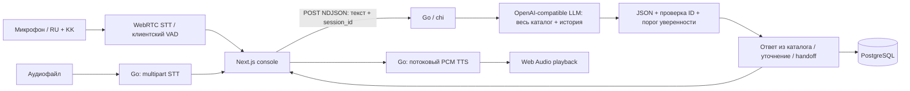

# Voice Router — технический контракт

## Архитектура



Один LLM-вызов выбирает сценарий, кратко объясняет границу с альтернативами, извлекает явно названные параметры и перечисляет отложенные темы. Энкодерного intent-классификатора в рабочем LLM-пути нет. Весь каталог передаётся стабильно в system prefix; история в user JSON. Это избегает потери нужного сценария из-за предварительного retrieval. Цена: большой каталог и объём вывода могут мешать цели 500 мс. Provider prompt caching отражается в cached_tokens, если провайдер возвращает их.

Ответы не генерируются вторым LLM. Это сокращает критический путь и исключает выдуманные операции. Шаблоны `response_ru/response_kk` — доверенные ответы каталога. Данные `knowledge_base.json` и `mock_backend.json` проверяются как JSON и загружаются, но запросов к реальному страховому backend нет. Их факты следует переносить в проверенные ответы при адаптации стартового кита. Требующие подтверждения сценарии помечаются; выполнение изменений вообще отключено.

## Данные

`DATA_DIR/scenarios.json`: массив либо `{ "scenarios": [...] }`. У каждого сценария строковые `id`, `name`, `description`, `boundaries`, `examples: string[]`, `response_ru`, `response_kk`, `requires_confirmation: bool`. Необязательные `required_slots`, `fact_ids` сохраняются в каталоге, автоматического исполнения по ним нет. Алиасы: `scenario_id/code` → id; `title/name_ru` → name; `purpose/description_ru` → description. Полный исходный объект передаётся LLM, поэтому дополнительные границы/примеры не теряются. Некорректные и повторяющиеся ID прекращают запуск. При несовместимой форме нужен явный адаптер; исходные 40 ID нельзя переименовывать.

Файл `SYNTHETIC_DEMO` помечает встроенные 12 сценариев как синтетические. Отсутствие файла не доказывает происхождение от организаторов: источник отображается `external`. SHA256 каталога отображается в health и trace. Evaluation fixtures никогда не загружаются маршрутизатором.

`voice_sessions(id text PK, payload jsonb, updated_at timestamptz)`: полный JSON сессии с репликами, решениями, вызовами и задержками. Миграция embed SQL выполняется при запуске. PostgreSQL в Compose обязателен; native без DATABASE_URL использует явно обозначенный memory store (до 1000 сессий). Он разрешён здесь для быстрого локального демо. Блокировки сериализуют реплики одной сессии в одном Go-процессе. Развёртывание — **одна backend-реплика**; горизонтальное масштабирование потребует распределённых блокировок/optimistic locking. PostgreSQL история/метрики ограничены последними 100 сессиями.

## HTTP API

Ошибки до начала stream: HTTP 4xx/5xx `{ "error": "..." }`. JSON ≤64 KiB, текст 1..4000 Unicode-символов. 409 — занятая сессия или лимит 10 реплик. Неизвестная сессия 404. 503 — недоступное хранилище. CORS допускает только явные origin из конфигурации.

| Метод / путь | Вход | Выход |
|---|---|---|
| GET /healthz (также /health) | — | status, provider, model, speech_provider, speech_ready, realtime_model, catalog_source/count/hash, storage, max_turns |
| GET /api/catalog | — | source, hash, scenarios[] |
| POST /api/sessions | — | новая Session |
| GET /api/sessions | — | Session[] |
| GET /api/sessions/{id} | — | Session, включая handoff-контекст |
| POST /api/route | RouteRequest | `{session_id, turn}` |
| POST /api/turns/stream | RouteRequest | NDJSON Event по мере этапов; последняя строка result |
| POST /api/transcribe | multipart: audio, ≤24 MiB | `{text, stt_ms, source}`; 503 без speech API |
| POST /api/realtime/connect | application/sdp offer, ≤128 KiB | application/sdp answer; server key остаётся в Go |
| GET /api/sessions/{id}/turns/{turn}/speech | — | signed PCM16 LE mono 24 kHz; поток, заголовок X-TTS-First-Byte-MS |
| POST /api/sessions/{id}/turns/{turn}/metrics | `{end_to_audio_ms?,tts_first_byte_ms?}` | `{ok:true}`; конечные числа 0..120000 |
| GET /api/stats | — | source_counts, routing_n, routing_p50_ms/p95_ms, audio_n, end_to_audio_p50_ms/p95_ms, note |

RouteRequest:
```json
{"session_id":"optional; empty creates session","text":"Полисімді ұзартқым келеді","input_kind":"text","stt_ms":120.0}
```
`input_kind`: text / microphone / audio_file. `stt_ms` необязателен. История достаётся сервером из session_id, а не доверяется клиентскому массиву.

Decision:
```json
{"scenario_id":"renew_policy","status":"route","confidence":0.9,"language":"kk","reason":"Клиент хочет продлить существующий полис.","alternatives":[],"slots":[],"pending":[]}
```
Все восемь полей обязательны. status=route|clarify|handoff, language=ru|kk|mixed, confidence ∈ [0,1]. ID должен существовать; для route обязателен. Альтернативы `{scenario_id,reason}` (до 3), slots `{name,value}` (до 12, значение ≤200 байт), pending до 4 существующих ID. Unknown JSON fields, null required fields, обрезанные ответы и придуманные ID отклоняются. Strict JSON Schema провайдера включена по умолчанию; локальная проверка всегда обязательна.

Turn: id, text, reply, decision, scenario_name, previous_scenario, topic_changed, source, calls[], timing, warnings[], created_at. Call: attempt, provider, model, latency_ms, prompt_tokens, completion_tokens, cached_tokens, error?. Session: id, turns[], active, pending[], created_at.

Event: `{type,elapsed_ms,data}`; типы input → routing_started → llm_attempt (0 в mock; до 2 для LLM) → routing_complete → policy → result. Ошибка сохранения даёт error и не даёт result. `routing_complete` — исходное решение LLM, `policy`/`result` — результат после порога уверенности. Фронтенд дополнительно показывает audio_started. Это события исполнения и публичное обоснование, не скрытые рассуждения модели.

## Отказы и контекст

Одна повторная попытка после временной ошибки/невалидной схемы, общий deadline `LLM_TIMEOUT` (по умолчанию 8s, максимум 30s) на обе попытки. 401/403 и другие постоянные HTTP 4xx не повторяются. У LLM-вызова логируются модель, провайдер, задержка, токены; ключи и сырой ответ провайдера не логируются. После исчерпания попыток — `source=provider_error`, handoff, явное предупреждение. **Автоперехода с реальной LLM на mock нет.**

Самооценка ниже 0.70 превращает route в clarify. После двух подряд нерешённых уточнений очередное clarify превращается в handoff. Смена active обновляется только при route. pending и полная история до 10 реплик дают LLM возможность вернуться к прерванной теме. Mock — изолированный детерминированный дубль на текстах каталога; он не претендует на смысловую точность и не входит в статистику LLM.

## Речь и измерения

WebRTC — только транскрипция, никаких автономных ответов speech-модели. Клиентский RMS VAD (порог 0.018, 3 voiced frames, пауза 360ms) отправляет input_audio_buffer.commit. Одна committed реплика на соединение исключает перестановку финальных событий между репликами. В шуме VAD нужно настраивать; лимит записи 30s, ожидания транскрипта 20s. File STT — запасной путь; аудиобайты реально отправляются API.

TTS выдаёт PCM по мере готовности; клиент планирует буферы Web Audio. Первое планирование + baseLatency/outputLatency — **оценка браузерного времени воспроизведения**, не аппаратный замер звука. `routing_ms` охватывает обе попытки и JSON validation; `policy_ms` — правила/шаблон; `server_ms` — время до сохранения; `stt_ms` для realtime — остаток после последнего voiced frame, включая VAD; для файла — HTTP STT. `tts_first_byte_ms` — запрос upstream → первые PCM bytes. `end_to_audio_ms` существует только при акустической отметке конца речи. Browser SpeechRecognition такой отметки не даёт, поэтому в этом пути E2E остаётся пустым. Клиентская телеметрия может быть неточной и не является доверенным benchmark.

Цели: routing ≤500ms, конец речи → начало ответа ≤1500ms. UI показывает превышения. Достижение целей не заявлено до измерения с настоящей моделью, RU/KK аудио, starter kit и реалистичной сетью. Синтетический тест оценивает регрессии, не обобщающую точность.

## Деплой

Backend root /backend, frontend root /frontend: Dockerfile. Railway Postgres DATABASE_URL → backend; CORS_ORIGINS → HTTPS origin фронтенда. NEXT_PUBLIC_API_URL — HTTPS адрес backend **на этапе сборки** frontend. Данные входят в backend/data или подключаются томом. Один backend instance. Публичный production потребует авторизации и ограничения расходов; текущая версия — стенд синтетической симуляции. Deployed URL пока отсутствует.
