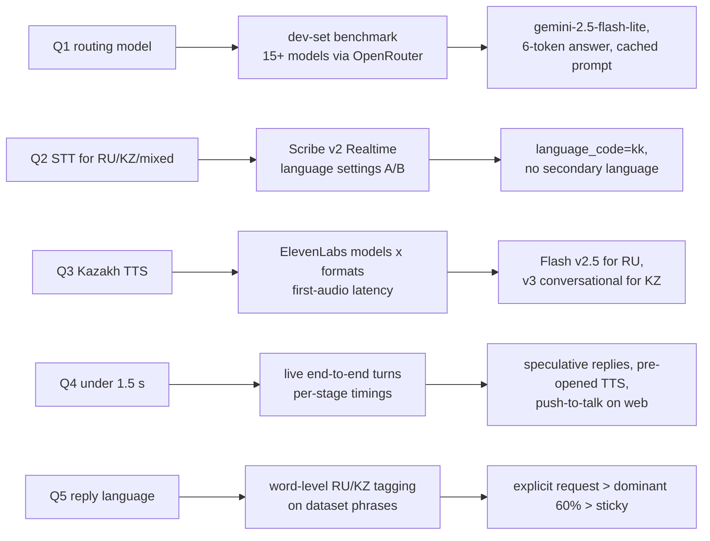
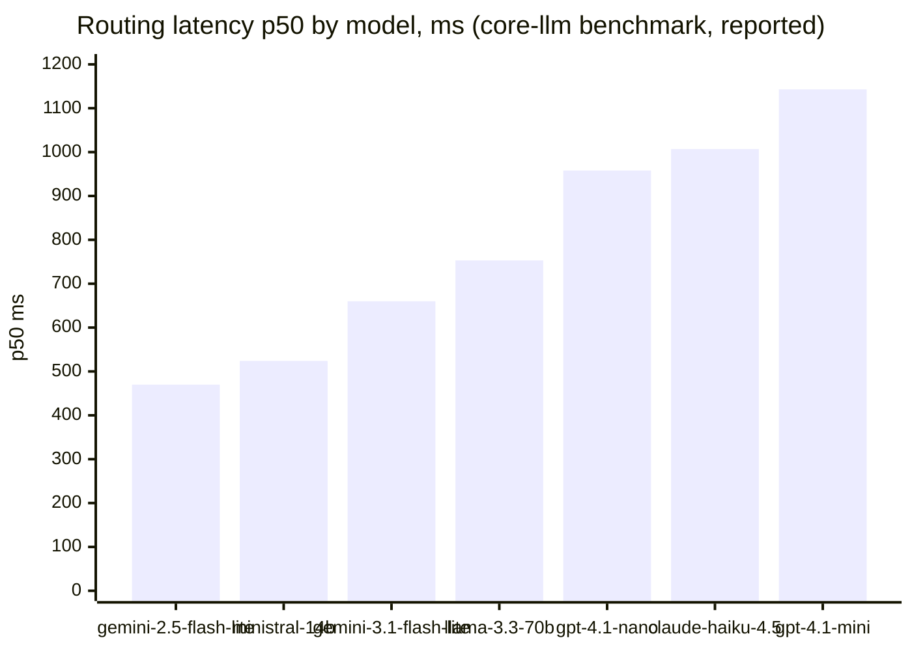
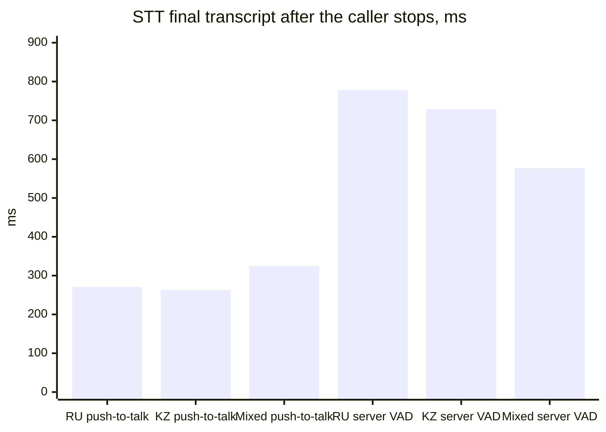
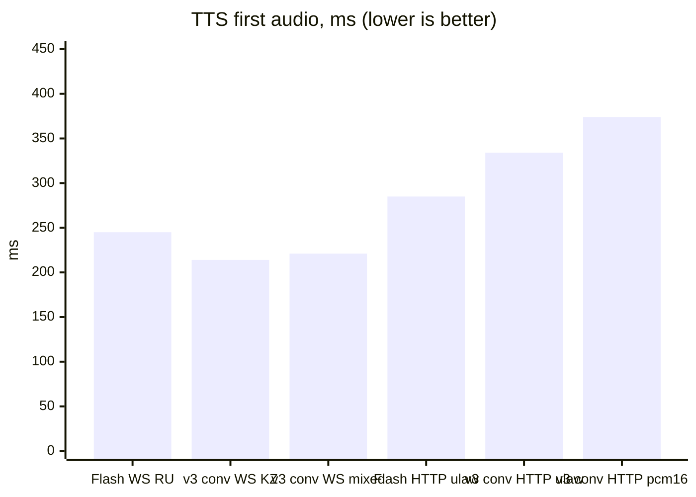
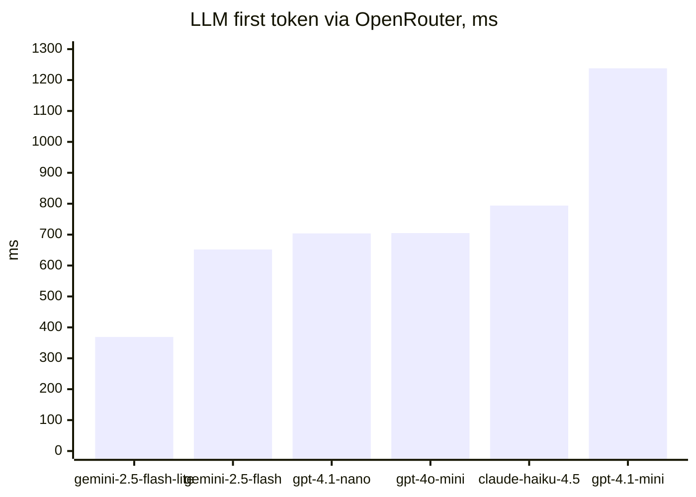
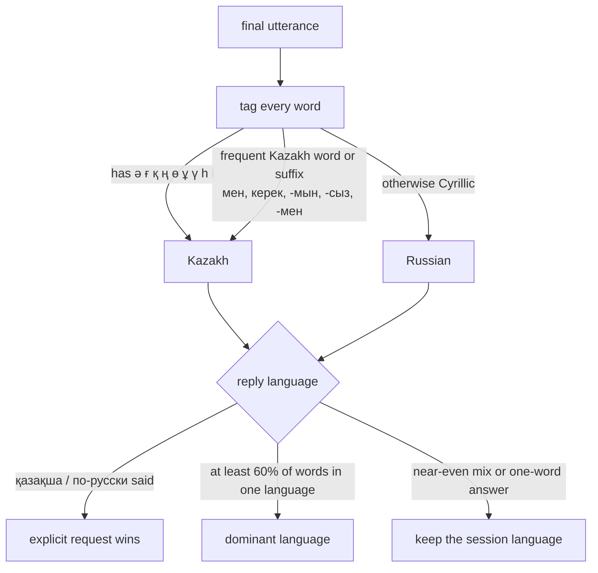

# Research log — what we measured and why we chose it

> Status: **living document** (2026-09-23). The numbers below are real measurements from this repository unless marked *reported* (taken from a component's own README) or *estimate*. Each section says how to reproduce it. New runs go in as new rows with the commit and date. Old rows stay.

**Contents:** [1. Questions](#1-research-questions) · [2. Method](#2-method) · [3. Routing](#3-routing-which-llm-picks-the-scenario) · [4. Speech-to-text](#4-speech-to-text-rukz-and-mixed-speech) · [5. Text-to-speech](#5-text-to-speech-kazakh-and-russian-voices) · [6. LLM speed](#6-llm-time-to-first-token) · [7. End to end](#7-end-to-end-latency-end-of-speech--reply-audio) · [8. Language](#8-reply-language-policy) · [9. Phone](#9-phone-channel) · [10. Decisions](#10-decisions-this-research-drove) · [11. Next](#11-open-questions-and-next-experiments)

Code for the voice experiments: [`voice/`](https://github.com/BAITC-Hacks/hack-9dd7b5f3-plus/tree/feat/voice-elevenlabs/voice) on branch `feat/voice-elevenlabs`. Raw measurements: [`voice/demos/RESULTS.md`](https://github.com/BAITC-Hacks/hack-9dd7b5f3-plus/blob/feat/voice-elevenlabs/voice/demos/RESULTS.md). The routing core is [`core-llm/`](../../core-llm/README.md). Earlier desk research: [DEEP_RESEARCH_REPORT.md](DEEP_RESEARCH_REPORT.md).

---

## 1. Research questions

The case scores four things we could not settle by opinion:

| # | Question | Why it matters for the case |
|---|---|---|
| Q1 | Which LLM routes 40 scenarios + 3 system intents most accurately **and** within 500 ms? | Routing is the core of the case; the target is "scenario choice ≤ 500 ms". |
| Q2 | Which speech-to-text understands **Kazakh, Russian and both inside one phrase**? | Live jury utterances are RU, KZ and mixed. |
| Q3 | Which text-to-speech can answer **in Kazakh** in real time? | The robot must reply in the caller's language. |
| Q4 | Can we reach **≤ 1.5 s from the end of speech to the start of the answer**? | The latency bonus is based on this number. |
| Q5 | How do we pick the reply language when a caller mixes languages? | Wrong-language replies break the dialog. |

## 2. Method

- **Data:** only the organizers' synthetic starter kit ([`data/`](../../data/)): 40 scenarios, 104 labeled dev utterances (52 ru / 45 kk / 7 mixed), 10 annotated dialogs. No real calls or personal data.
- **Speech inputs:** caller phrases synthesized with ElevenLabs (RU, KZ, mixed), then streamed back into STT **at real-time pace in 20 ms frames**, exactly like a live caller. The WAVs are committed, so every run uses the same audio.
- **Timing:** each stage is timed on the server. "End of speech" is the end of the caller's last word, taken from Scribe's word timestamps and mapped back to wall-clock time ([`elevenlabs.STTSession.SpeechEnd`](https://github.com/BAITC-Hacks/hack-9dd7b5f3-plus/blob/feat/voice-elevenlabs/voice/elevenlabs/stt_realtime.go)). We never start the clock at the commit, because that would hide the VAD wait.
- **Where:** one laptop in Astana over the public internet, APIs called from Kazakhstan, 2026-09-23. Latencies are single runs or small samples. They show orders of magnitude, not SLAs.
- **Reproduce:** `cd voice && go run ./cmd/voicedemo tts && go run ./cmd/voicedemo stt && go run ./cmd/voicedemo e2e` (keys in `.env`). Live tests: `VOICE_LIVE=1 go test ./elevenlabs/ ./server/ -run Live -v`.

## 3. Routing: which LLM picks the scenario

*Reported* by [`core-llm`](../../core-llm/README.md) (official `data/evaluate.py`, 104 dev utterances, commit `a39cbb4`), plus our *measured* keyword baseline:

| Router | Primary accuracy | Full match | Multi-intent recall | Dialog turns (40) | Scenario choice p50 / p95 |
|---|---:|---:|---:|---:|---:|
| **LLM router** `core-llm` · gemini-2.5-flash-lite (OpenRouter) | **100 %** | **100 %** | **100 %** | **39/40** | **457 / 617 ms** |
| Keyword baseline (mock, in browser) | 97.1 % | 97.1 % | 100 % | 28/40 | < 1 ms |

Both dev-set scores are in-sample: the prompt was refined on this set. The multi-turn dialogs (39/40) and the jury's hidden utterances are the real test. The full model table is in the [README §9.1](../../README.md#91-routing-accuracy-on-the-dev-set).

## 4. Speech-to-text: RU/KZ and mixed speech

**Model:** ElevenLabs `scribe_v2_realtime` (WebSocket, streaming partials, word timestamps). Same three recordings, three language settings:

| Setting | Russian phrase | Kazakh phrase | Mixed KZ+RU phrase | Verdict |
|---|---|---|---|---|
| auto-detect (no `language_code`) | — | ❌ transcribed as **Turkish** ("Selam Eczacı Bey, Kalay Kümek'ten…", `lang=tr`) | — | unusable for KZ |
| `ru` + secondary `kk` | ✅ | ✅ | ⚠️ bent into Russian spelling ("Я ше аварияга түстым") | no |
| `kk` + secondary `ru` | ✅ | ✅ | ⚠️ Russian-biased ("Салем, я цезбер…") | no |
| **`kk` only** | ✅ exact | ✅ exact | ✅ "Сәлеметсіз бе? Іші аварияға түстім, **но я не виноват**" (1 word off) | **chosen** |

Expected mixed phrase: «Сәлеметсіз бе, кеше аварияға түстім, но я не виноват.» With `language_code=kk`, Scribe still writes Russian words in Russian.

**Latency** (audio streamed at real-time pace; *final* = committed transcript):

| Mode | Russian | Kazakh | Mixed | Used for |
|---|---:|---:|---:|---|
| push-to-talk: client commits on button release → final | **271 ms** | **263 ms** | **325 ms** | web |
| server VAD (0.5 s silence window): end of audio → final | 778 ms | 729 ms | 577 ms | phone, hands-free |

Observation: the first partial transcript arrives ~2.2–2.4 s into the stream, so partials are good for captions and speculation, but not for instant barge-in on very short phrases.

## 5. Text-to-speech: Kazakh and Russian voices

Language support (ElevenLabs model docs, checked 2026-09-23): **Flash v2.5** has 32 languages, Russian yes, **Kazakh no**. **Multilingual v2** has 29, no Kazakh. **eleven_v3 / eleven_v3_conversational** have 70+ **including Kazakh**. v3 conversational is the only realtime option for Kazakh, and it streams through the text-to-dialogue WebSocket.

First audio latency, *measured*:

| Model | Transport | Output format | First audio | Connect (hidden: opened in advance) |
|---|---|---|---:|---:|
| `eleven_flash_v2_5` (RU) | WebSocket stream-input | pcm_16000 | **245 ms** · 211 ms (2nd phrase) | 226–273 ms |
| `eleven_v3_conversational` (KZ) | WebSocket text-to-dialogue | pcm_16000 | **214 ms** · 208 ms | 198 ms |
| `eleven_v3_conversational` (mixed) | WebSocket text-to-dialogue | pcm_16000 | 221 ms | 190 ms |
| `eleven_flash_v2_5` | HTTP stream | pcm_8000 / ulaw_8000 | 292 / 285 ms | — |
| `eleven_v3_conversational` | HTTP stream | pcm_8000 / ulaw_8000 / pcm_16000 | 378 / 334 / 374 ms | — |

Findings:
- Over WebSockets, v3 conversational is **as fast as Flash**, so a Kazakh reply costs no extra latency.
- Every channel gets its **native format**: `pcm_16000` (browser), `pcm_8000` (Asterisk), `ulaw_8000` (Twilio). Nothing is resampled or decoded on our side.
- The first HTTP call paid ~600 ms (TLS handshake). Hence a keep-alive transport, warm-up on start, and a TTS socket opened on the caller's first partial transcript.

## 6. LLM time to first token

One streamed Kazakh prompt per model through OpenRouter with `provider.sort = latency`. First call per model, so the TLS handshake is included (*measured*, single sample):

| Model | First token | Kazakh reply quality (by eye) |
|---|---:|---|
| **google/gemini-2.5-flash-lite** | **369 ms** | natural |
| google/gemini-2.5-flash | 652 ms | natural (a "thinking" model: slower and can use up the token limit) |
| openai/gpt-4.1-nano | 704 ms | ok |
| openai/gpt-4o-mini | 705 ms | ok |
| anthropic/claude-haiku-4.5 | 794 ms | ok |
| openai/gpt-4.1-mini | 1238 ms | ok |

This agrees with the routing benchmark (§3): gemini-2.5-flash-lite is the default for routing and for the spoken reply. Fallbacks are non-"thinking" models (`gpt-4o-mini`, `gpt-4.1-nano`).

## 7. End-to-end latency: end of speech → reply audio

Live turns with real providers: Scribe v2 Realtime → OpenRouter (gemini-2.5-flash-lite, Saqta catalog in the prompt) → ElevenLabs TTS. Phone-like **server-VAD** mode, measured from the end of the caller's last word:

| Call | Transcript (STT) | Scenario | STT final | LLM first text | TTS first audio | **Reply audio starts** | First sound incl. filler |
|---|---|---|---:|---:|---:|---:|---:|
| RU: charged, no policy | «…деньги списались, а полис не пришёл» | SC30 · 0.95 ✅ | 1076 ms | 531 ms | 234 ms | **1703 ms** (speculative) | 1703 ms |
| KZ: policy renewal | «Сәлеметсіз бе! …мерзімін ұзар… келеді» | SC27 · 0.95 ✅ | 1087 ms | 495 ms | 206 ms | **1916 ms** | 1501 ms |
| Mixed: victim claim | «…аварияға түстім, но я не виноват» | SC12 · 0.75 ✅ | 837 ms | 732 ms | 180 ms | **1950 ms** | 1501 ms |
| Browser WebSocket, live test | «…а полис не пришёл» | SC30 · 0.95 ✅ | 934 ms | 472 ms | 239 ms | **1748 ms** | 1748 ms |

Measured timeline (live WebSocket turn):

```mermaid
gantt
  title Measured turn, phone-like VAD mode (ms after the caller's last word)
  dateFormat x
  axisFormat %S.%L s
  section Hear
  VAD silence + STT final      :stt, 0, 934ms
  section Decide + answer
  LLM first text               :crit, llm, after stt, 472ms
  section Speak
  TTS first audio              :tts, after llm, 239ms
  network + buffer             :net, after tts, 103ms
  section Target
  1.5 s target                 :milestone, m1, 1500, 0ms
```

Estimate for the web with push-to-talk (the STT row from §4 replaces the VAD wait):

```mermaid
gantt
  title Web push-to-talk turn (estimate from measured stages, ms after button release)
  dateFormat x
  axisFormat %S.%L s
  section Hear
  STT final after release      :stt, 0, 290ms
  section Decide + answer
  LLM first text               :crit, llm, after stt, 500ms
  section Speak
  TTS first audio              :tts, after llm, 230ms
  network + buffer             :net, after tts, 100ms
  section Target
  1.5 s target                 :milestone, m1, 1500, 0ms
```

What this tells us:
- **Phone mode is 1.7–1.95 s, above the 1.5 s target.** About 0.8–1.1 s of it is Scribe deciding the turn is over (0.4–0.5 s silence window plus commit). That is the part to attack next (§11).
- **Web push-to-talk should land around 1.1 s**, inside the target. This is an estimate; a measured end-to-end run is ⏳.
- A **speculative reply** starts from a stable partial transcript and is kept if the final transcript matches (the RU call above). The filler «Секунду.» / «Бір сәт.» covers slow turns at 1.5 s.
- **Routing was correct in every live call** (SC30, SC27, SC12), even when STT garbled Kazakh words.

## 8. Reply-language policy

Kazakh and Russian share the Cyrillic script, so the language is decided per word ([`voice/lang`](https://github.com/BAITC-Hacks/hack-9dd7b5f3-plus/tree/feat/voice-elevenlabs/voice/lang)):

Checked on dataset phrases (unit tests): «Сәлеметсіз бе, полисімнің мерзімін ұзартқым келеді» → KZ. «Здравствуйте, хочу продлить полис» → RU. The mixed accident phrase is tagged *mixed* with Russian dominant. A one-word «иә» or «да» never flips the session language.

## 9. Phone channel

The case asks for voice in the web; a phone number is our extra. Options we compared:

| Option | KZ number | Our pipeline, trace and logs | Setup | Verdict |
|---|---|---|---|---|
| KZ SIP trunk → **Asterisk AudioSocket** → our gateway | ✅ | ✅ full | VPS + provider credentials | **chosen** ([guide](https://github.com/BAITC-Hacks/hack-9dd7b5f3-plus/blob/feat/voice-elevenlabs/voice/deploy/README.md)) |
| Twilio Media Streams | ❌ no KZ numbers (BYOC possible) | ✅ full | fastest | backup |
| ElevenLabs Agents (native SIP) | ✅ | ❌ their pipeline | fast | plan C |

Status: both transports pass tests against a simulated Asterisk and a simulated Twilio. A real SIP trunk is ⏳. Expected phone overhead: carrier ~100–250 ms round trip (*estimate*).

## 10. Decisions this research drove

| Decision | Evidence |
|---|---|
| Route with **gemini-2.5-flash-lite**, 6-token answer, byte-identical cached prompt | §3: 100 % dev / 39 of 40 dialog turns, 457 ms p50 |
| STT **`language_code=kk`**, no secondary language | §4: auto-detect → Turkish; secondary `ru` bends mixed speech |
| TTS **Flash v2.5 for Russian, v3 conversational for Kazakh**, same voice | §5: only v3 speaks Kazakh; both ~210–250 ms first audio over WebSockets |
| **Push-to-talk on the web**, server VAD only on the phone | §4 + §7: removes the ~0.8–1.1 s end-of-turn wait |
| **Pre-open TTS socket**, keep-alive transport, warm-up, cached greeting/filler | §5: cold first call ~600 ms vs ~250 ms warm |
| **Speculative reply** on a stable partial transcript | §7: hit in the RU call |
| Measure from the **last word**, count filler separately | §2 + §7: honest numbers; first version of our metric hid ~0.5 s |
| Phone via **Asterisk AudioSocket** | §9: only option with a KZ number and our own trace |

## 11. Open questions and next experiments

- ⏳ **Measure the web push-to-talk turn end to end** (expected ~1.1 s) and run the README §8.2 walkthrough in real mode (median + p95).
- ⏳ **Shorten end-of-turn on the phone:** try `VOICE_VAD_SILENCE_SECS` 0.3–0.35 (split utterances are merged by the engine) and a server-side silence detector, and compare Scribe partial stability.
- ⏳ **Real human voices** instead of synthesized callers (RU, KZ, mixed; noisy room), plus word error rate per language.
- ⏳ **Native Kazakh/Russian TTS voice** from the ElevenLabs library (the current voice is a premade English one speaking both).
- ⏳ **Independent re-run of the routing benchmark** on the committed predictions, and a hold-out split that was not used for prompt tuning.
- ⏳ **Phone:** connect a KZ SIP trunk and measure carrier overhead.
